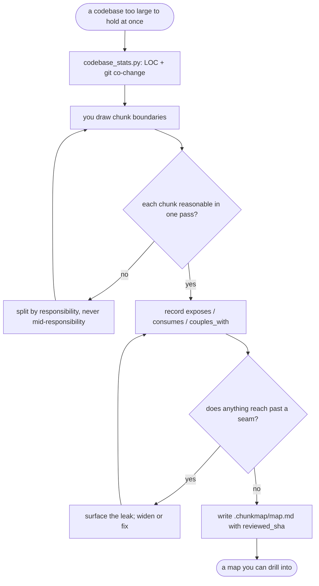

# chunk-map — flow

## Gate evidence

| Gate | Kind | Evidence |
|---|---|---|
| G_SIZE | agent | SKILL.md: "split when you can no longer answer what this does, what it exposes, what it depends on" |
| G_LEAK | agent | SKILL.md's seam-leak verification step; the grep is the operator's, and a hit is surfaced not silently widened |
