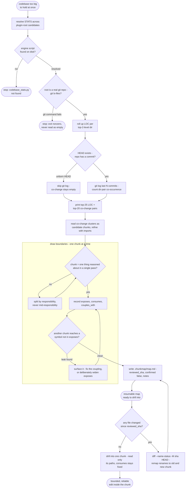

# chunk-map — flow

Co-change first, imports second: the engine (`codebase_stats.py`) surfaces LOC rollups
and which directories change together in git history; the agent reads that as candidate
chunk boundaries, sizes each by reasoning capacity rather than a line count, records its
seams, and greps for leaks past them before writing the resumable map. Source:
`shared/skills/chunk-map/SKILL.md`; engine: `shared/skills/chunk-map/scripts/codebase_stats.py`.

## Gate evidence

| Gate | Kind | Evidence |
|---|---|---|
| G_FOUND | agent | no eval covers this; SKILL.md's engine-resolution loop exits 1 when codebase_stats.py isn't found on any candidate path |
| G_REPO | code | `shared/skills/chunk-map/scripts/codebase_stats.py::def _git` - the check=True fatal exit, exercised by `shared/skills/chunk-map/scripts/codebase_stats.py::_self_test` |
| G_HEAD | code | `shared/skills/chunk-map/scripts/codebase_stats.py::has_head` |
| G_SIZE | agent | `evals/chunk-map/evals.json::Sizes by reasoning capacity / one coherent responsibility, NOT a fixed line count` |
| G_LEAK | agent | `evals/chunk-map/evals.json::SURFACES it (either fix the coupling, or add the symbol to exposes deliberately) rather than silently widening the seam` |
| G_STALE | agent | `evals/chunk-map/evals.json::Does NOT store an is_stale flag; derives staleness lazily at read time` |
