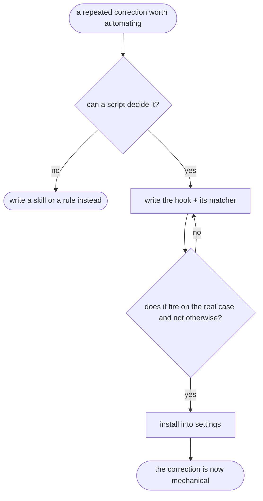

# hookify — flow

## Gate evidence

| Gate | Kind | Evidence |
|---|---|---|
| G_DETERMINISTIC | agent | SKILL.md: a hook is for what a script can decide; judgement stays in a skill |
| G_TESTED | agent | SKILL.md requires firing the hook on a real case before installing it |
