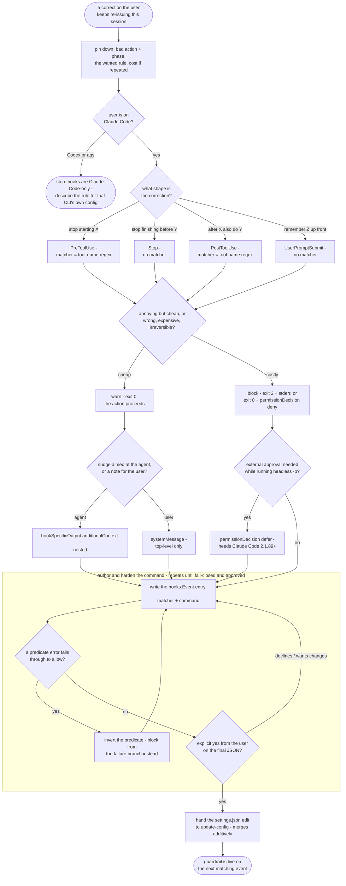

# hookify — flow

Claude-Code-only, and it says so before it writes anything: a Codex or agy user gets a
plain-language rule instead of a hook that won't fire for them. The correction's shape
picks the event (start-blocking is PreToolUse, finish-gating is Stop, follow-up is
PostToolUse), its cost picks warn vs block, and every command is hardened so a missing
or erroring predicate blocks rather than silently falls open. Nothing is written to
settings.json without an explicit yes. Source: `shared/skills/hookify/SKILL.md`.

## Gate evidence

| Gate | Kind | Evidence |
|---|---|---|
| G_ONPLATFORM | agent | no eval covers this; SKILL.md frontmatter — "Emits CLAUDE-CODE hooks only — Codex and agy have their own mechanisms, so it points their users to that config instead". The eval that graded it was dropped 2026-08-08: it scored 10/12 on BOTH conditions, i.e. a baseline already refuses to hand a Claude hook to a Codex user |
| G_SHAPE | agent | `evals/hookify/evals.json::Maps 'don't FINISH before doing Y' to a Stop hook (gates completion), NOT a PreToolUse tool gate and not PostToolUse` |
| G_COST | agent | `evals/hookify/evals.json::Recognizes this is a WARN (not block) guardrail and that the natural event (PostToolUse — the edit already happened, or a non-blocking PreToolUse) cannot/should not prevent the action` |
| G_AUDIENCE | agent | `evals/hookify/evals.json::distinguishes it from systemMessage, which surfaces a note to the USER` |
| G_HEADLESS | agent | `evals/hookify/evals.json::ask prompts interactively and does not exit the process with the call preserved` |
| G_FAILOPEN | agent | no eval covers the jq-error path; SKILL.md §"Fail closed, not open" — a naive `jq -e … && {block} || exit 0` blocks only when jq succeeds, so invert the predicate and deny from the `||` branch. Dropped 2026-08-08 at 12/12 on BOTH conditions. The SIBLING fail-open mechanism is now graded instead: `evals/hookify/evals.json::Identifies exit code 1 as the cause: only exit 2 is the BLOCKING exit code` |
| G_CONFIRM | agent | `evals/hookify/evals.json::Confirms before writing the hook to settings.json` |
