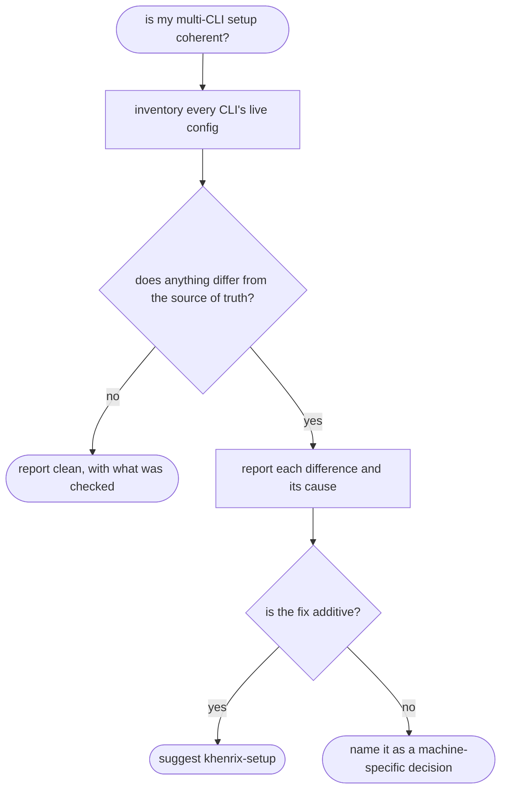

# khenrix-audit — flow

## Gate evidence

| Gate | Kind | Evidence |
|---|---|---|
| G_DRIFT | code | `scripts/env_inventory.py::def _self_test` |
| G_FIXABLE | agent | SKILL.md: reconcile is additive; anything destructive is the user's call |
