# khenrix-audit — flow

A deterministic engine runs sixteen checks and reconciles the ledger; the model then
adjudicates B6's heuristic skill-overlap nominations, gathers tiered evidence for the
ambiguous ones, and walks every non-informational finding through a guided apply with a
destructive-ops safety rail and an engine-only waive path. Source:
`shared/skill-templates/khenrix-audit/SKILL.md.tmpl`; engine:
`shared/skill-templates/khenrix-audit/scripts/setup_audit.py`.

```mermaid
flowchart TD
    accTitle: khenrix-audit engine and guided-apply flow
    accDescr: A deterministic engine runs sixteen checks and reconciles the ledger, then the model reads findings.json. Informational findings are excluded from guided apply. B6's heuristic skill-overlap nominations are adjudicated per pair, with tiered evidence gathered only for the ambiguous ones. Ecosystem discovery and the report follow, then a guided apply walks every finding with a destructive-ops safety rail and an engine-only waive path.

    START([is my multi-CLI<br/>setup coherent?]) --> ENGINE[Step 1: run the engine's findings<br/>command - inventory, checks B1-B16,<br/>reconciles ledger waivers]
    ENGINE --> G_ERRORS{discovery errors<br/>non-empty?}
    G_ERRORS -- "no" --> READ[Step 2: read findings.json<br/>branch on capabilities, not CLI name]
    G_ERRORS -- "yes, report first" --> READ
    READ --> G_INFORMATIONAL{finding marked<br/>informational?}
    G_INFORMATIONAL -- "yes, NOT EVALUATED or<br/>semantics unverified" --> EXCLUDED([excluded from guided apply])
    G_INFORMATIONAL -- "no" --> G_ISB6{rule is B6,<br/>heuristic nomination only?}

    subgraph B6LOOP ["Phase C/D - per B6 pair, max 3 full-body reads"]
        ADJUDICATE[classify DISTINCT / AMBIGUOUS /<br/>DUPLICATE from trigger surfaces<br/>+ frontmatter only]
        ADJUDICATE --> G_AMBIGUOUS{classified<br/>AMBIGUOUS?}
        G_AMBIGUOUS -- "yes" --> G_PROBE{capabilities.can_probe?}
        G_PROBE -- "yes" --> PROBE[Tier 2: live probes<br/>k>=3, fire-rates,<br/>INCONCLUSIVE if unstable]
        G_PROBE -- "no" --> ARENA[Tier 1: arena eval<br/>confusion matrix]
    end

    G_ISB6 -- "yes" --> ADJUDICATE
    G_ISB6 -- "no" --> REPORT[Phase E/F: ecosystem discovery<br/>with citations, then write the report<br/>- model annotations added below]
    G_AMBIGUOUS -- "no, DISTINCT or DUPLICATE" --> REPORT
    PROBE --> REPORT
    ARENA --> REPORT

    subgraph APPLYLOOP ["Phase G - per non-informational finding, by severity"]
        APPLY[offer: apply / not now / waive /<br/>accept / reject / detail]
        APPLY --> G_DESTRUCTIVE{action removes<br/>or disables something?}
        G_DESTRUCTIVE -- "yes" --> BACKUP[confirm individually, write a<br/>restore bundle, then record in ledger]
        G_DESTRUCTIVE -- "no" --> G_WAIVE{action is waive?}
        G_WAIVE -- "yes" --> LEDGERADD[ledger-add via the engine,<br/>never by hand]
    end

    REPORT --> APPLY
    DONE([apply loop complete;<br/>re-run the engine before<br/>further mutation])
    BACKUP --> DONE
    LEDGERADD --> DONE
    G_WAIVE -- "no" --> DONE
```

## Gate evidence

| Gate | Kind | Evidence |
|---|---|---|
| G_ERRORS | code | `tests/test_setup_audit.py::def test_b10_converts_walker_errors_to_findings` |
| G_INFORMATIONAL | code | `tests/test_setup_audit.py::def test_finding_unverified_cli_is_informational` |
| G_ISB6 | agent | no eval covers this; SKILL.md Phase C: "Do not act on a nomination without adjudication" |
| G_AMBIGUOUS | agent | no eval covers this; SKILL.md Phase C — classify DISTINCT / AMBIGUOUS / DUPLICATE with one sentence of reasoning before any evidence-gathering begins |
| G_PROBE | agent | no eval covers this; references/probe-protocol.md's tier rule — live probes are Tier 2, gated on capabilities.can_probe, while the arena is Tier 1 and always available |
| G_DESTRUCTIVE | agent | no eval covers this; SKILL.md.tmpl §7 — "Destructive ops (any removal/disable): confirm individually, write a restore bundle (`*.khenrix-backup` convention) BEFORE, record in the ledger AFTER". The eval that graded it was removed 2026-08-08: the old set scored 36/36 vs 35/36, i.e. a baseline already volunteered the backup-first discipline |
| G_WAIVE | agent | `evals/khenrix-audit/evals.json::Records a desired-state POLICY, not a waiver — `ledger-add --subject mcp:google-drive --desired-state managed-absent --reason ...`, keyed by subject rather than by finding id` |
