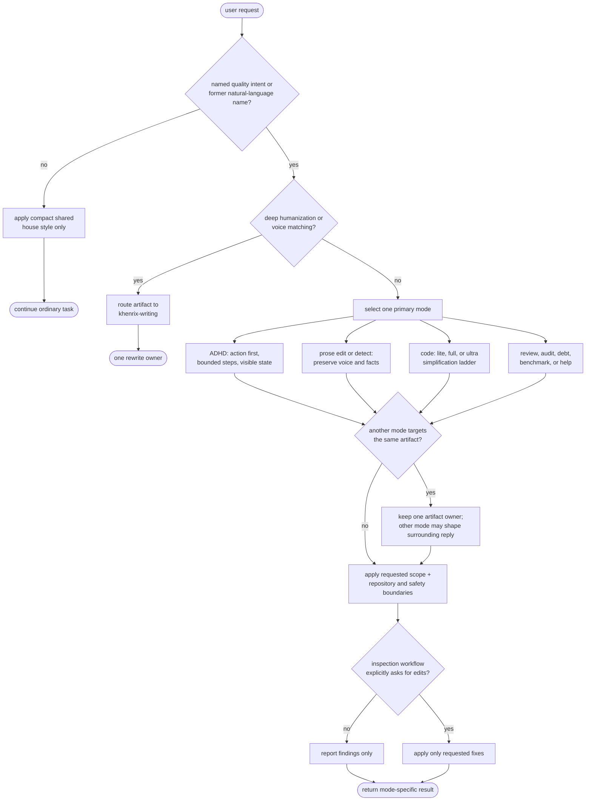

# khenrix-quality - flow

An explicit request selects one focused mode. ADHD may shape the surrounding response,
but only one prose mode owns an artifact; specialist workflows and repository safeguards
keep precedence. Source: `shared/skills/khenrix-quality/SKILL.md`.

## Gate evidence

| Gate | Kind | Evidence |
|---|---|---|
| G_EXPLICIT | agent | `evals/khenrix-quality/triggers.json::use the former ponytail-audit workflow on this repository` |
| G_WRITING | agent | `evals/khenrix-quality/arena.json::humanize this cover letter and match the casual voice in my sample` |
| G_OWNER | agent | `evals/khenrix-quality/evals.json::Does not provide a rewritten paragraph` |
| G_WRITE | agent | `evals/khenrix-quality/evals.json::REVIEW reports an actionable path-and-line-style yagni or shrink finding for SenderFactory, protects the validator and useful tests, and applies no fix` |
