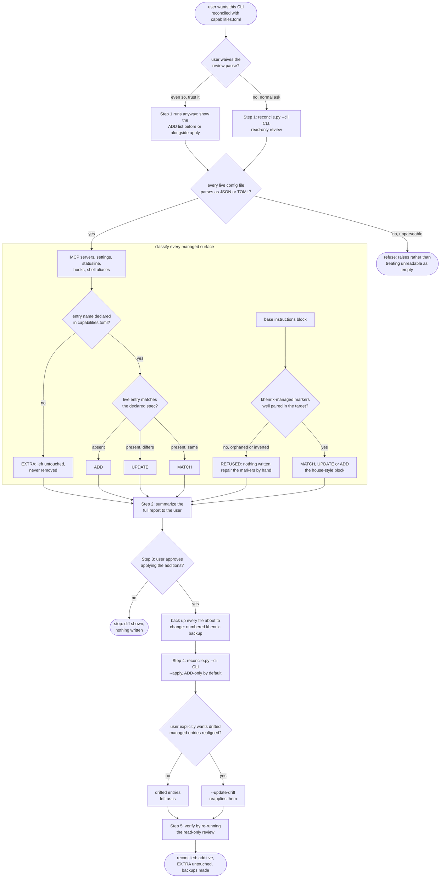

# khenrix-setup — flow

Rendered per CLI from ONE shared template — this chart draws that shared flow, not any
single CLI's rendering. The read-only review always runs first, even when the user tries
to waive it. Every managed surface is classified against `capabilities.toml` as EXTRA /
ADD / UPDATE / MATCH; an unreadable config file or an unpaired instruction marker refuses
rather than guesses. The user confirms before an additive apply, and drifted managed
entries are left alone unless `--update-drift` is asked for. Source:
`shared/skill-templates/khenrix-setup/SKILL.md.tmpl`; engine `scripts/lib/reconcile.py`.

## Gate evidence

| Gate | Kind | Evidence |
|---|---|---|
| G_WAIVE | agent | `evals/khenrix-setup/evals.json::Still does a read-only review first and surfaces what will be added before applying, instead of blindly applying because the user said to skip it` |
| G_READABLE | code | `scripts/lib/reconcile.py::def read_json_object` |
| G_DECLARED | code | `scripts/lib/reconcile.py::def classify_mcp` |
| G_DRIFT | code | `scripts/lib/reconcile.py::def mcp_drift` |
| G_MARKERS | code | `scripts/lib/reconcile.py::def instructions_report` |
| G_CONFIRM | agent | `evals/khenrix-setup/evals.json::Requires explicit user confirmation before applying (an --apply run); does not apply changes unprompted` |
| G_UPDATE_DRIFT | agent | no eval covers this; SKILL.md.tmpl's Notes section — default behavior leaves drifted managed entries as-is, only an explicit `--update-drift` re-applies them |
