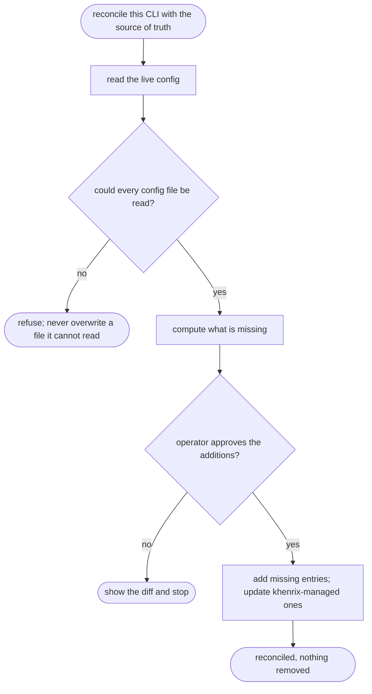

# khenrix-setup — flow

## Gate evidence

| Gate | Kind | Evidence |
|---|---|---|
| G_READABLE | code | `scripts/lib/reconcile_test.py::def run` |
| G_APPROVE | agent | SKILL.md's procedure shows the diff before applying |
