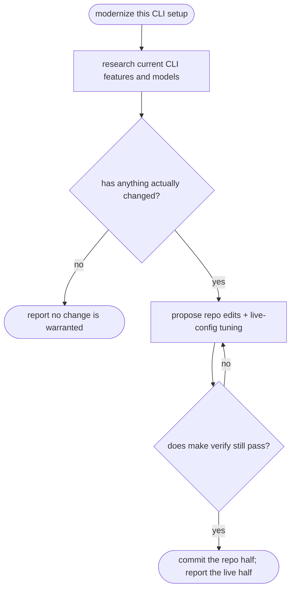

# khenrix-upgrade — flow

## Gate evidence

| Gate | Kind | Evidence |
|---|---|---|
| G_CHANGED | agent | SKILL.md: research first; an unchanged upstream means no edit |
| G_GATED | code | `scripts/render.py::def check` |
