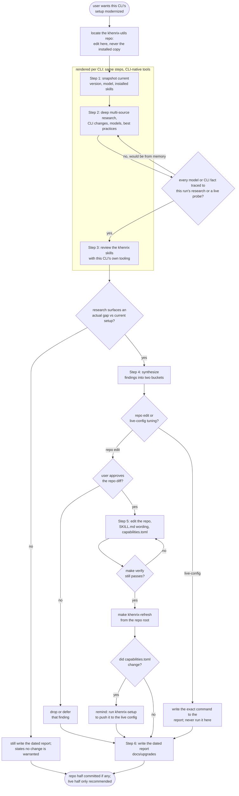

# khenrix-upgrade — flow

Rendered per CLI from ONE shared template — this chart draws that shared flow; only the
research sources and native review tooling differ per rendered CLI, the steps themselves
do not. Inventory, then research that must be sourced this run rather than recalled from
memory, then a review of the khenrix skills. Findings only proceed once research shows an
actual gap, and then split into a repo-edit bucket (applied with confirmation, gated on
`make verify`) versus a live-config bucket that is only ever recommended. Every run ends
with the dated report, even a no-change one. Source:
`shared/skill-templates/khenrix-upgrade/SKILL.md.tmpl`.

## Gate evidence

| Gate | Kind | Evidence |
|---|---|---|
| G_CITED | agent | `evals/khenrix-upgrade/evals.json::Researches the current recommended model before answering rather than guessing` |
| G_CHANGED | agent | no eval covers this; SKILL.md.tmpl's Ground rules — repo edits follow research finding a genuine gap, never a scheduled churn |
| G_BUCKET | agent | `evals/khenrix-upgrade/evals.json::Separates changes into two buckets: repo edits applied with confirmation, vs live-config tuning that is only recommended (never auto-applied)` |
| G_APPROVE | agent | no eval covers this; SKILL.md.tmpl's Step 5 — show each change as a diff and get approval before editing the repo |
| G_GATED | code | `scripts/render.py::def check` |
| G_CAPCHANGED | agent | no eval covers this; SKILL.md.tmpl's Step 5 — if capabilities.toml changed, remind the user to run khenrix-setup to apply it to the live config |
