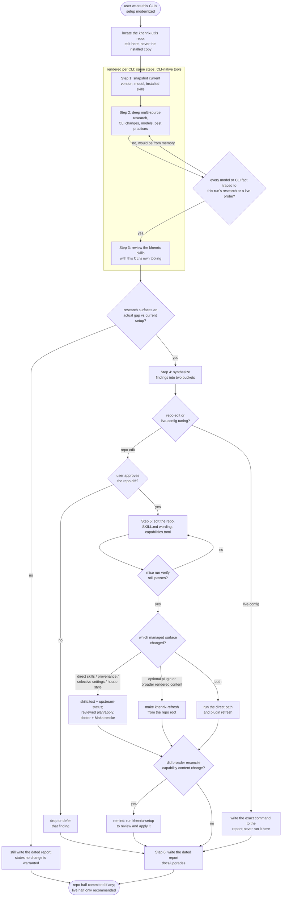

# khenrix-upgrade — flow

Rendered per CLI from ONE shared template — this chart draws that shared flow; only the
research sources and native review tooling differ per rendered CLI, the steps themselves
do not. Inventory, then research that must be sourced this run rather than recalled from
memory, then a review of the khenrix skills. Findings only proceed once research shows an
actual gap, and then split into a repo-edit bucket (applied with confirmation, gated on
`mise run verify`) versus a live-config bucket that is only ever recommended. Repo edits
then take the direct-copy path, the optional-plugin path, or both according to the files
changed. Every run ends with the dated report, even a no-change one. Source:
`shared/skill-templates/khenrix-upgrade/SKILL.md.tmpl`.

## Gate evidence

| Gate | Kind | Evidence |
|---|---|---|
| G_CITED | agent | ``evals/khenrix-upgrade/evals.json::Uses the supplied dated research evidence to recommend `claude-opus-5` and does not replace it with an unverified model guess or claim to have performed new live research`` |
| G_CHANGED | agent | no eval covers this; SKILL.md.tmpl's Ground rules — repo edits follow research finding a genuine gap, never a scheduled churn |
| G_BUCKET | agent | `evals/khenrix-upgrade/evals.json::Separates changes into two buckets: repo edits applied with confirmation, vs live-config tuning that is only recommended (never auto-applied)` |
| G_APPROVE | agent | no eval covers this; SKILL.md.tmpl's Step 5 — show each change as a diff and get approval before editing the repo |
| G_GATED | code | `scripts/render.py::def check` |
| G_DELIVERY | agent | `evals/khenrix-upgrade/evals.json::Chooses delivery by changed surface` |
| G_BROADCAP | agent | no eval covers this; SKILL.md.tmpl's Step 5 — if broader reconcile capabilities changed, remind the user to run khenrix-setup to review and apply them |
