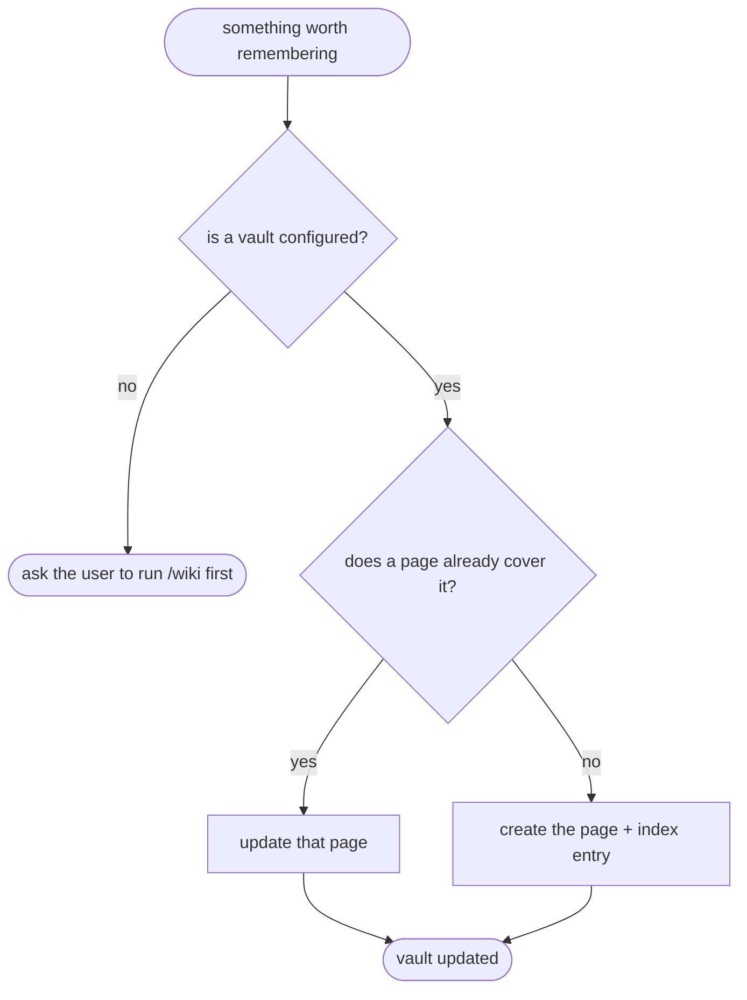

# khenrix-wiki-add — flow

## Gate evidence

| Gate | Kind | Evidence |
|---|---|---|
| G_VAULT | agent | covered by the wikisync unittests, which `make eval SKILL=khenrix-wiki-add` runs as its deterministic gate (`eval_harness.DETERMINISTIC_GATED`) |
| G_EXISTS | agent | SKILL.md: check for an existing page and offer to update rather than duplicate |
