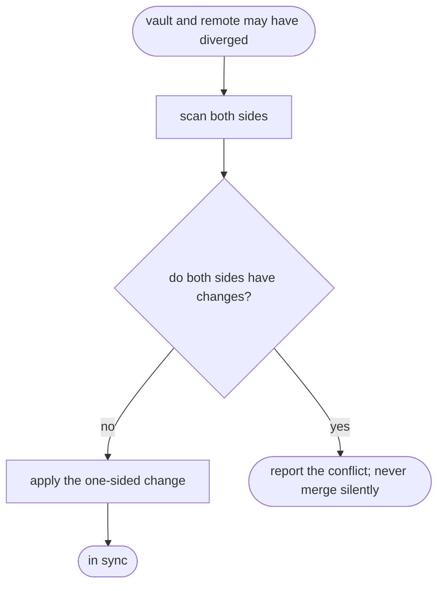

# khenrix-wiki-sync — flow

## Gate evidence

| Gate | Kind | Evidence |
|---|---|---|
| G_CONFLICT | agent | covered by the wikisync unittests, which `make eval SKILL=khenrix-wiki-sync` runs as its deterministic gate (`eval_harness.DETERMINISTIC_GATED`) |
