# khenrix-wiki-sync — flow

Probe every source, adopt any already-ledgered page, then per enabled source plan a diff
against the ledger — only a COMPLETE snapshot may mark anything removable, and a page is
never deleted regardless. The Instagram live accelerator is opt-in and authorized, and its
scroll-collect loop stops at a complete list end or immediately on any friction signal.
Jobs ingest through the wiki-add flow with a bot-block-then-archive fallback, and a capped
deep pass covers recipes missing from the caption. Its receipt is earned by the wikisync
unit suite (`eval_harness.DETERMINISTIC_GATED`), not the LLM judge. Source:
`shared/skills/khenrix-wiki-sync/SKILL.md`; engine `shared/lib/wikisync/`.

```mermaid
flowchart TD
    accTitle: khenrix-wiki-sync flow
    accDescr: Probe every source, adopt any already-ledgered page, then per enabled source plan a diff against the ledger where only a complete snapshot may mark anything removable. The Instagram live accelerator is opt-in and authorized, and its scroll-collect loop stops at a complete list end or immediately on any friction signal. Jobs ingest through the wiki-add flow with a bot-block-then-archive fallback, a capped deep pass covers recipes missing from the caption, and a page is never deleted.

    START([user wants the whole<br/>saved corpus reconciled]) --> LOCATE[locate the wikisync engine<br/>across this CLI's plugin roots]
    LOCATE --> G_ENGINE{wikisync directory<br/>found anywhere?}
    G_ENGINE -- "no" --> HALT_ENGINE([stop: wikisync engine not found])
    G_ENGINE -- "yes" --> PROBE[wk probe: bookmarks, ig export,<br/>ig live, watch, wiki_plugin]

    PROBE --> G_ADOPT{a vault page already has a<br/>source_url but no ledger entry?}
    G_ADOPT -- "yes" --> ADOPT[wk adopt: join the ledger,<br/>no duplicate created]
    G_ADOPT -- "no" --> G_AVAILABLE
    ADOPT --> G_AVAILABLE{probe shows this source<br/>available, checked per source?}

    G_AVAILABLE -- "no" --> DEFER_SRC[deferred: capability_unavailable,<br/>never a silent empty success]
    G_AVAILABLE -- "yes, instagram-live" --> G_LIVE_OPTIN{opt-in AND the owner<br/>expressly authorized this pass?}
    G_LIVE_OPTIN -- "no" --> USE_EXPORT[fall back to the<br/>export-only path]
    G_LIVE_OPTIN -- "yes" --> SCROLLSTART

    subgraph SCROLLLOOP [instagram-live: scroll-collect loop]
        SCROLLSTART[collect hrefs, scroll one<br/>viewport, wait about 2s] --> G_SCROLL_STOP{list end after 3 empty scrolls,<br/>or a login, 429, or challenge?}
        G_SCROLL_STOP -- "neither yet" --> SCROLLSTART
    end

    G_SCROLL_STOP -- "list end: status complete" --> PLAN
    G_SCROLL_STOP -- "friction: stop now, status partial" --> PLAN
    USE_EXPORT --> PLAN
    G_AVAILABLE -- "yes, bookmarks or export" --> PLAN[wk plan: diff the<br/>snapshot against the ledger]

    PLAN --> G_COMPLETE{snapshot status<br/>is complete?}
    G_COMPLETE -- "no, partial or failed" --> NO_REMOVE[new and updated recorded;<br/>nothing marked removable]
    G_COMPLETE -- "yes" --> MAYBE_REMOVE[items absent from the snapshot<br/>land in the removable list]

    NO_REMOVE --> INGEST
    MAYBE_REMOVE --> INGEST[ingest jobs: fetch in parallel,<br/>commit one at a time]

    INGEST --> G_BOTBLOCK{fetch is bot-blocked<br/>or genuinely unreachable?}
    G_BOTBLOCK -- "bot-blocked" --> BROWSER_FALLBACK[re-fetch on Claude via<br/>the chrome-devtools browser]
    G_BOTBLOCK -- "genuinely dead" --> ARCHIVE_FALLBACK[try the Wayback Machine<br/>before it can be deferred]
    G_BOTBLOCK -- "fetched cleanly" --> COMMIT_JOB
    BROWSER_FALLBACK --> COMMIT_JOB
    ARCHIVE_FALLBACK --> COMMIT_JOB[wk commit, serialized<br/>under the vault lock]

    COMMIT_JOB --> G_DEEP_CANDIDATE{standard pass left<br/>no usable recipe?}
    G_DEEP_CANDIDATE -- "yes, capped at 10/run;<br/>extras stay queued" --> DEEP[watch deep capture,<br/>then commit]
    G_DEEP_CANDIDATE -- "no, complete or not a recipe" --> REPORT

    DEEP --> REPORT
    DEFER_SRC --> REPORT[wk report: job-state counts;<br/>removable is reported, never deleted]
    REPORT --> DONE([sync summarized: created, updated,<br/>deep-queued, deferred, removable])
```

## Gate evidence

| Gate | Kind | Evidence |
|---|---|---|
| G_ENGINE | agent | no eval covers this; SKILL.md's Locate the engine + probe section — same refusal as khenrix-wiki-add when no CLI plugin root has a `wikisync` directory |
| G_ADOPT | agent | no eval covers this; SKILL.md's First run: adopt existing pages section — join the ledger instead of duplicating a hand-made page |
| G_AVAILABLE | agent | `evals/khenrix-wiki-sync/evals.json::instead of producing pages, and does NOT fabricate posts or an empty successful result` |
| G_LIVE_OPTIN | agent | no eval covers this; SKILL.md's Instagram — live accelerator section — opt-in AND the account owner expressly authorized this pass |
| G_SCROLL_STOP | agent | no eval covers this; SKILL.md's Instagram — live accelerator section, scroll-loop rule — 3 empty scrolls at list end is complete, a login, 429, or challenge stops immediately as partial |
| G_COMPLETE | agent | `evals/khenrix-wiki-sync/evals.json::Because the snapshot status is 'partial', the engine's diff (plan_diff) marks NOTHING removable — ABC111 and DEF222 are left untouched` |
| G_BOTBLOCK | agent | no eval covers this; SKILL.md's Ingest the jobs section — bot-blocked is a distinct reason from unavailable, re-fetched via the chrome-devtools browser fallback before the Wayback Machine |
| G_DEEP_CANDIDATE | agent | no eval covers this; SKILL.md's Deep pass (capped) section — queue only a job whose standard pass yielded no usable recipe, capped at deep_cap per run |
