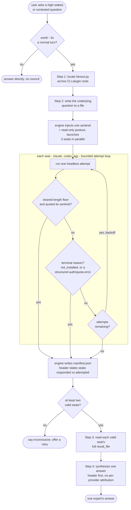

# llm-council — flow

Fan one question out to three CLIs in parallel: a cost gate, then each seat runs a
bounded attempt loop — valid, a terminal failure, or a retry — until the engine writes
a manifest. Two or more valid seats synthesize into one answer; fewer than two is
reported inconclusive. Source: `shared/skills/llm-council/SKILL.md`; engine:
`shared/lib/council/engine.py`.

## Gate evidence

| Gate | Kind | Evidence |
|---|---|---|
| G_JUSTIFIES | agent | no eval covers this; SKILL.md's "Cost & when to use" callout — three full agent turns in parallel, ~3x a normal turn, so the caller weighs it before convening |
| G_VALID | code | `tests/test_council_seat_validity.py::def test_substantive_response_citing_sentinel_is_ok` |
| G_TERMINAL | code | `tests/test_council_seams.py::def test_agys_structured_timeout_keeps_its_retries_but_its_quota_wall_does_not` |
| G_ATTEMPTS | code | `tests/test_council_seat_validity.py::def test_only_missing_binary_is_terminal_all_scan_derived_reasons_retry` |
| G_TWO | agent | no eval covers this; SKILL.md: fewer than two valid providers must be reported plainly as an inconclusive council rather than synthesized as if the panel were complete |
