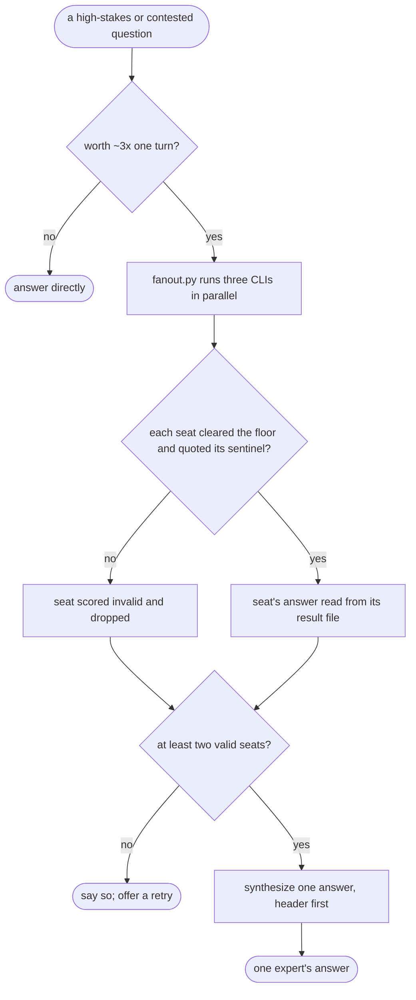

# llm-council — flow

## Gate evidence

| Gate | Kind | Evidence |
|---|---|---|
| G_JUSTIFIES | agent | SKILL.md's cost note; the caller decides before convening |
| G_VALID | code | `tests/test_council_seat_validity.py::def test` |
| G_TWO | agent | SKILL.md: "if fewer than two providers are valid, say plainly that the council was inconclusive" |
