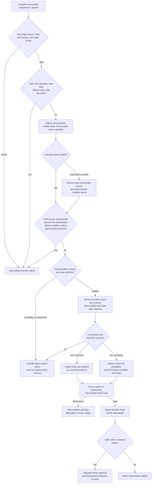

# llm-fanout-execute — durable owner execution

An admitted plan enters one owner-controlled run. This diagram describes v1 execution: `start` schedules only, and `resume` crosses the provider-spend boundary after exact preflight. V2 accepts distinct repository targets but currently starts dormant and refuses public provider spend. Source: `shared/skills/llm-fanout-execute/SKILL.md`; owner CLI: `shared/skills/llm-fanout-execute/scripts/execute.py`.

| Gate | Kind | Evidence |
|---|---|---|
| G_ADMISSION | code | `tests/test_fanout_execute_skill.py::test_bare_compiled_write_plan_is_not_an_admission`, `tests/test_fanout_execute_skill.py::test_write_bundle_requires_separate_exact_owner_review` |
| G_DESCRIPTOR | code | `tests/test_fanout_execute_skill.py::test_pre_descriptor_crash_reopens_same_run_without_provider_spend` |
| G_PREFLIGHT | code | `tests/test_fanout_execute_skill.py::test_memory_preflight_requires_authenticated_initialized_worker` |
| G_START_BOUNDARY | code | `tests/test_fanout_execute_skill.py::test_public_start_rejects_repo_write_before_git_version_or_roots`, `tests/test_fanout_execute.py::test_mixed_plan_rejects_repo_write_before_first_read_only_profile_probe` |
| G_RESUME_BOUNDARY | code | `tests/test_fanout_execute_skill.py::test_public_cold_resume_rejects_repo_write_before_workspace_git_or_version`, `tests/test_fanout_execute_skill.py::test_public_resume_inspects_journal_before_mutating_recovery`, `tests/test_fanout_runstate.py::test_inspect_exposes_fsynced_pending_state_without_authority_commit` |
| G_FINAL | code | `tests/test_fanout_execute_skill.py::test_resume_fuses_two_hermetic_seats_and_cold_opens_completed_result`, `tests/test_fanout_execute_skill.py::test_inspect_candidates_exports_exact_final_seats_privately` |
| G_ACTION | code | `tests/test_fanout_execute.py::test_orchestrator_actions_remain_owner_barriers_and_never_reach_maka_or_a_provider` |

Additional evidence:

| Gate | Evidence |
|---|---|
| Bare compiled write plans and stale bundle review are refused | `tests/test_fanout_execute_skill.py::test_bare_compiled_write_plan_is_not_an_admission`, `test_write_bundle_requires_separate_exact_owner_review` |
| Authenticated, initialized claude-mem worker is required | `tests/test_fanout_execute_skill.py::test_memory_preflight_requires_authenticated_initialized_worker` |
| Owner capability is outside the run and privately reopened | `tests/test_fanout_execute_skill.py::test_private_descriptor_refuses_broad_modes_symlinks_and_tamper`, `test_start_and_cold_status_use_real_durable_stores_without_spend` |
| Dirty baseline is immutable across caller changes and rejects tamper | `tests/test_fanout_execute_skill.py::test_cold_status_reopens_original_baseline_after_caller_changes`, `test_cold_open_refuses_tampered_baseline_artifact_before_provider` |
| Pre-descriptor crash and failed preflight recover without a provider turn | `tests/test_fanout_execute_skill.py::test_pre_descriptor_crash_reopens_same_run_without_provider_spend`, `test_failed_start_preflight_is_retryable_without_provider_spend`, `test_recover_start_repairs_only_its_exact_atomic_publication_link` |
| Accepted amendment cold-open restores replacement bindings | `tests/test_fanout_execute_skill.py::test_accepted_amendment_cold_reopens_replacement_before_resume`, `test_accepted_profile_transition_cold_reopens_pinned_registry` |
| Scheduler-advanced amendment intent has authenticated cold recovery and rejects a stale replacement CLI | `tests/test_fanout_execute_skill.py::test_cli_recovers_scheduler_advanced_pending_amendment_after_cold_open`, `test_cli_recovers_pending_profile_transition_from_durable_descriptors` |
| Accepted journal with predecessor execution CAS reopens the predecessor; tampered bindings fail closed | `tests/test_fanout_execute_skill.py::test_cli_recovers_accepted_journal_before_execution_cas_after_cold_open` |
| Repository-write spend refuses when the native seat boundary is unproved | `tests/test_fanout_providers.py` repository-write initial/resume and mixed-batch refusal cases |
| Unchecked answer selection binds the named seat to the exact final answer | `tests/test_fanout_execute_skill.py::test_unchecked_selection_ref_must_belong_to_named_seat` |
| Owner candidate inspection exports only exact final-seat full manifests to private files and refuses tamper | `tests/test_fanout_execute_skill.py::test_inspect_candidates_exports_exact_final_seats_privately`, `test_inspect_candidates_refuses_tampered_final_artifact` |
| Real durable rounds can be reconciled after cold reopen | `tests/test_fanout_execute_skill.py::test_resume_fuses_two_hermetic_seats_and_cold_opens_completed_result` |
| Nested invocation is refused | `tests/test_fanout_execute_skill.py::test_nested_executor_cannot_orchestrate` |
| V2 starts one dormant run for two writers using the same ticket in distinct repositories | `tests/test_fanout_multirepo_integration.py::test_two_writer_admission_starts_dormant_owner_run` |
| Two local handovers create one ticket-keyed commit per repository, with an orchestrator-only barrier | `tests/test_fanout_multirepo_integration.py::test_two_repositories_one_run_two_ticket_branches` |
| One admitted v2 packet completes native fake-seat rounds, exact-session resumes, target-specific synthesis, and both handovers | `tests/test_fanout_multirepo_integration.py::test_admitted_packet_runs_native_fake_seats_through_both_handovers` |
| A failed dependent target preserves the delivered target and cold status stays read-only | `tests/test_fanout_multirepo_integration.py::test_failed_booking_after_address_delivery_cold_reopens_as_partial` |

The chart describes a control boundary, not a model judge. Same-UID private paths and separate Git workspaces are not a native seat boundary. V1 read-only runs remain available while repository-write isolation is uncertified. Live pressure cases and installation checks remain separate release gates. An action approval is a digest-bound attestation, not cryptographic proof of who reviewed it.

V2 operator flow today: approve a target-aware bundle separately, then `start --admission-file ... --target-root address=/absolute/address --target-root booking=/absolute/booking` with the run, authority, private, skill-root, and turn-budget flags. `status --private-root ...` can cold-inspect target progress. A verified candidate can be delivered only through an exact owner-approved `handover`; `recover-handover` uses the authenticated pending intent and association. Different repositories may use the same ticket key and independent branch refs. Task11's injected test runner exercised the native policy with disposable `/bin/sh` seats and denied cross-target reads; it did not run Claude, Codex, or agy, or certify a credential route. Public v2 `resume` still refuses provider turns until the live native and tokenless-auth matrix is certified. Pushes, PRs, Jira changes, and deployments remain separate owner actions.
