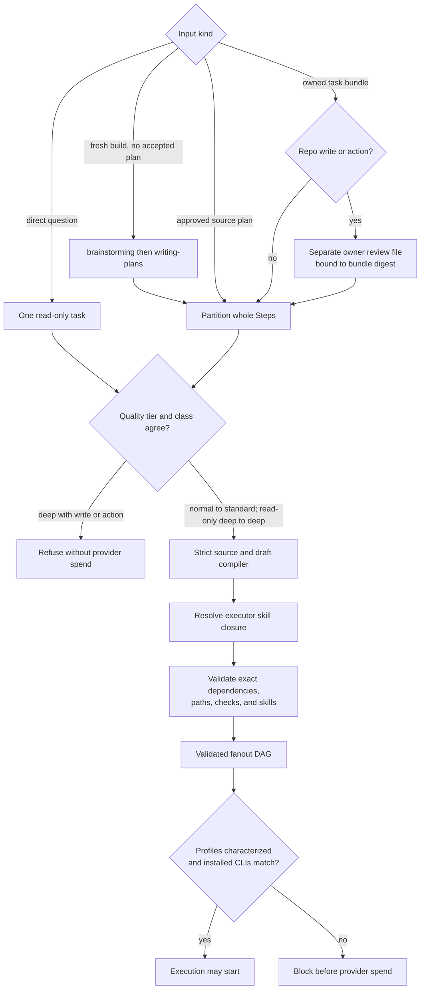

# llm-fanout-plan — admission and compilation

One accepted input becomes one validated, skill-aware DAG. Claude, Codex, and agy are executor seats inside each work task, not extra DAG nodes. Source: `shared/skills/llm-fanout-plan/SKILL.md`; deterministic compiler: `shared/lib/fanout/compiler.py`.

| Gate | Evidence |
|---|---|
| Direct question has one read-only task | `tests/test_fanout_plan_skill.py::test_direct_question_is_one_read_only_task_with_invocation_approval` |
| Direct deep question preserves its tier | `tests/test_fanout_plan_skill.py::test_direct_question_preserves_deep_tier_for_one_read_only_task` |
| Hidden or malformed source tier is refused | `tests/test_fanout_compiler.py::test_compiler_refuses_hidden_or_malformed_source_tier_hint` |
| Read-only task may use deep under normal defaults | `tests/test_fanout_compiler.py::test_compiler_preserves_task_local_deep_read_only_in_standard_plan` |
| Uncharacterized deep profile blocks before spend | `tests/test_fanout_profiles.py::test_uncharacterized_deep_turn_blocks_without_provider_spend` |
| Write review is separate and byte-bound | `tests/test_fanout_plan_skill.py::test_write_bundle_requires_digest_bound_owner_review`, `test_bundle_cannot_self_assert_its_owner_review` |
| Source/draft/skill drift is refused | `tests/test_fanout_plan_skill.py::test_compile_and_validate_recompute_exact_source_and_draft` |
| Source work cannot disappear or claim false write concurrency | `tests/test_fanout_compiler.py::test_parser_rejects_action_or_constraints_after_task_section`, `test_compiler_rejects_repo_write_without_owned_paths`, `test_compiler_requires_one_repo_write_owner_for_each_source_task` |
| Runtime and memory controller are delivered and receipt-bound | `tests/test_fanout_plan_skill.py::test_delivery_stages_runtime_and_memory_and_receipt_covers_both` |

Source and bundle tiers bind plan defaults; normal defaults may contain a read-only deep task. A top-level deep plan contains only read-only deep work. A source Task declaring `Create`/`Modify` paths has one repo-write owner; separate owners for those paths need separate approved source Tasks. Read-only source Steps may join distinct writers whose write paths come from other source Tasks. The chart's execution preflight is a separate admission gate; compilation does not characterize an installed CLI or approve provider spend. Owner review is a digest-bound attestation, not cryptographic identity proof.

Bundle write admission uses `from-bundle` with a separate `--owner-review-file`. The `compile` and `validate` commands do not accept that option. Changing declared bundle values after review requires a new review bound to the new canonical digest.
