# llm-forge — flow

One task, three CLIs, each building in an isolated clone; a fresh verifier clone checks
every candidate before you fuse them by hand. A cost gate and a preflight refusal come
before any spend, the operator agrees to a priced quote, and `--collect`/`--gc` each
refuse rather than guess. Source: `shared/skills/llm-forge/SKILL.md`; engine:
`shared/lib/forge/`.

```mermaid
flowchart TD
    accTitle: llm-forge build-fuse-collect flow
    accDescr: One task built three ways in isolated clones, verified in a fresh clone each builder never touched. A cost gate and a preflight refusal come before any spend; the operator agrees to a priced quote; the fleet builds and verifies; the operator writes the ledger and fuses by hand; collect and gc each refuse rather than guess.

    START([user wants a hard change<br/>built several ways]) --> G_WORTH{worth ~22 provider calls<br/>and ~63 GB peak disk?}
    G_WORTH -- "no" --> COUNCIL([use llm-council instead<br/>read-only, ~3x one turn])
    G_WORTH -- "yes" --> LOCATE[Step 1: locate forge.py<br/>across CLI plugin roots]
    LOCATE --> PREFLIGHT[static preflight: scan the task bundle<br/>for provider-specific machinery,<br/>screen the tracked set + --select paths for secrets]
    PREFLIGHT --> G_REFUSED{preflight refuses?}
    G_REFUSED -- "yes" --> HALT_PRE([stop: nothing spent])
    G_REFUSED -- "no" --> QUOTE[--start prints the full quote<br/>+ a wall-clock upper bound]
    QUOTE --> G_AGREE{operator agrees<br/>to the priced answer sheet?}
    G_AGREE -- "no" --> STOP([nothing spent])
    G_AGREE -- "yes" --> FLEET[opens the run, builds baseline B1,<br/>launches the fleet, verifies each<br/>candidate - stops at comparing]
    FLEET --> LEDGER[Step 3: you write the claim ledger<br/>reading all three candidates]
    LEDGER --> G_LEDGER_OK{ledger validates?}
    G_LEDGER_OK -- "no, fix and resubmit" --> LEDGER
    G_LEDGER_OK -- "yes" --> FUSE[Step 4: fuse in the synthesis worktree<br/>write and commit the best-of-all answer]
    FUSE --> G_REVIEW{convene the optional<br/>--review panel?}
    G_REVIEW -- "yes" --> REVIEWRUN[Step 5: three blind reviewers read<br/>a fresh clone of the fusion commit]
    REVIEWRUN --> G_BLOCKED{a round nobody<br/>answered?}
    G_BLOCKED -- "yes, review_blocked" --> COLLECT
    G_BLOCKED -- "no, findings recorded" --> COLLECT
    G_REVIEW -- "no" --> COLLECT[Step 6: --collect resolves<br/>strategy + mergeability]
    COLLECT --> G_COLLECT_OK{synthesis differs from B1<br/>and from every seat's candidate?}
    G_COLLECT_OK -- "no" --> REFUSE_COLLECT([refused: not a fusion])
    G_COLLECT_OK -- "yes" --> HANDOVER[prints the handover:<br/>patch or branch, Verified /<br/>Fusion / Council / Deep review lines]
    HANDOVER --> G_GC{--gc: handed over,<br/>worktree clean, refs free?}
    G_GC -- "no" --> REFUSE_GC([refused: nothing deleted])
    G_GC -- "yes" --> DONE([reclaimed: peak disk<br/>returned to the OS])
```

## Gate evidence

| Gate | Kind | Evidence |
|---|---|---|
| G_WORTH | agent | no eval covers this; SKILL.md's cost box — ~22 provider calls (3 of them the deep review's own council fan-out) and ~63.3 GB peak disk, use llm-council instead for anything read-only |
| G_REFUSED | code | `tests/test_forge_preflight.py::def test_a_task_naming_provider_specific_machinery_is_refused` and `tests/test_forge_preflight.py::def test_a_secret_in_a_selected_path_is_a_refusal_not_a_note` |
| G_AGREE | code | `tests/test_forge_gate.py::def test_a_quote_cannot_carry_a_number_nobody_could_agree_to` |
| G_LEDGER_OK | code | `tests/test_forge_ledger.py::def test_a_row_whose_id_does_not_hash_its_own_claim_is_refused` |
| G_REVIEW | agent | no eval covers this; SKILL.md section 5 — `--review` is optional, run only after the ledger is written and the fusion is committed |
| G_BLOCKED | code | `tests/test_forge_review.py::def test_a_round_nobody_answered_is_blocked_rather_than_degraded` |
| G_COLLECT_OK | code | `tests/test_forge_cli.py::def test_collect_refuses_a_synthesis_worktree_nobody_fused_in` and `tests/test_forge_cli.py::def test_collect_refuses_a_fusion_byte_identical_to_a_seats_candidate` |
| G_GC | code | `tests/test_forge_gc.py::def test_a_synthesis_worktree_that_was_never_handed_over_is_refused` |
