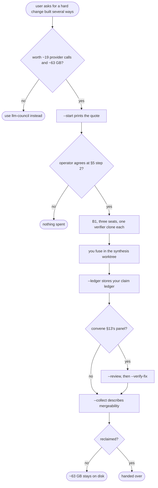

# llm-forge — flow

## Gate evidence

| Gate | Kind | Evidence |
|---|---|---|
| G_WORTH | agent | SKILL.md's cost box states the quote before any spend; the operator decides |
| G_AGREE | code | `tests/test_forge_gate.py::def test_a_quote_cannot_carry_a_number_nobody_could_agree_to` |
| G_REVIEW | code | `tests/test_forge_review.py::def test_a_round_nobody_answered_is_blocked_rather_than_degraded` |
| G_GC | code | `tests/test_forge_gc.py::def test` |
