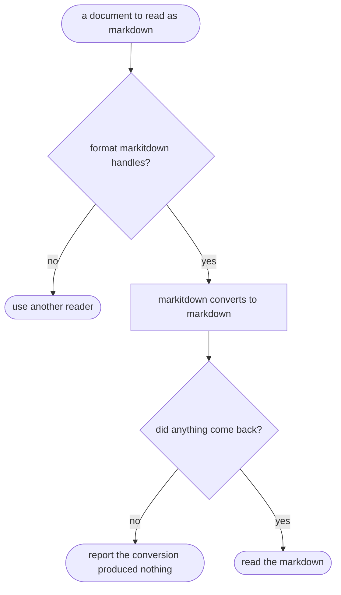

# markitdown — flow

## Gate evidence

| Gate | Kind | Evidence |
|---|---|---|
| G_SUPPORTED | agent | SKILL.md lists the formats; an unsupported one is declined rather than attempted |
| G_EMPTY | agent | SKILL.md: an empty conversion is reported, never presented as an empty document |
