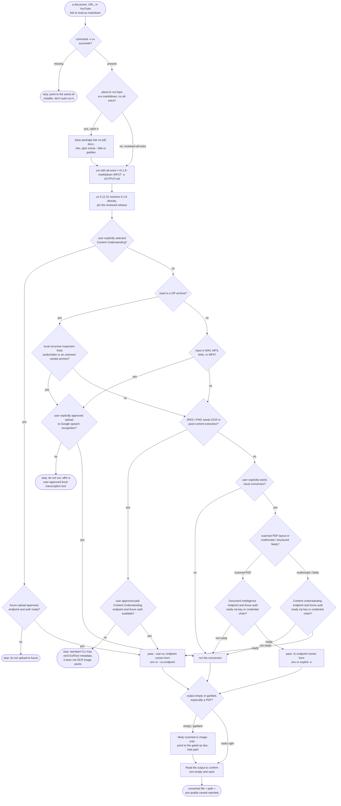

# markitdown — flow

Prose-only: there is no bundled engine, so every gate here is judgment the skill
documents rather than a script the repo tests. The one rule that matters is never bare
`uvx markitdown` - always the `[all]` extra - and everything else is preflighting `uv`,
requiring consent before audio/video transcription uploads audio to Google, keeping both paid
Azure conversion paths opt-in and endpoint-gated, and
reading the output back before calling it done. Source: `shared/skills/markitdown/SKILL.md`.

## Gate evidence

| Gate | Kind | Evidence |
|---|---|---|
| G_UV | agent | `evals/markitdown/evals.json::before attempting the conversion` |
| G_EXTRAS | agent | `evals/markitdown/evals.json::installs the BASE package only (no docx/pdf/office extras) and fails or returns empty/garbled output on real office files` |
| G_AUDIO | agent | `evals/markitdown/evals.json::WAV, MP3, M4A, and MP4 inputs` |
| G_AUDIO_APPROVAL | agent | `evals/markitdown/evals.json::Requires explicit approval before running an audio/video conversion` |
| G_ARCHIVE | agent | `evals/markitdown/evals.json::ZIP conversion recursively dispatches nested members` |
| G_ARCHIVE_CONTENTS | agent | `evals/markitdown/evals.json::requires a local recursive member inspection first` |
| G_EXPLICIT_CU | agent | `evals/markitdown/evals.json::routes supported audio/video to Azure Content Understanding instead` |
| G_CU_READY | agent | `evals/markitdown/evals.json::separate Azure consent, endpoint, and authentication` |
| G_IMAGE | agent | `evals/markitdown/evals.json::can emit ExifTool metadata for JPEG/PNG when ExifTool is available` |
| G_IMAGE_CLOUD | agent | `evals/markitdown/evals.json::explicit Azure Content Understanding` |
| G_HIFI | agent | `evals/markitdown/evals.json::paid external service` |
| G_CLOUD | agent | `evals/markitdown/evals.json::For an explicit Content Understanding run` |
| G_DOC_ENDPOINT | agent | `evals/markitdown/evals.json::AZURE_API_KEY` |
| G_CU_ENDPOINT | agent | `evals/markitdown/evals.json::DefaultAzureCredential` |
| G_EMPTY | agent | `evals/markitdown/evals.json::Explains the default local extraction can't read image-only / scanned PDFs (no embedded text → empty output)` |
