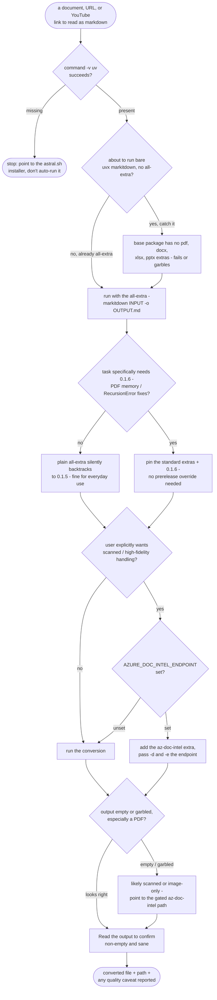

# markitdown — flow

Prose-only: there is no bundled engine, so every gate here is judgment the skill
documents rather than a script the repo tests. The one rule that matters is never bare
`uvx markitdown` - always the `[all]` extra - and everything else is preflighting `uv`,
picking the right pin when 0.1.6 is needed, keeping the paid Azure OCR path opt-in, and
reading the output back before calling it done. Source: `shared/skills/markitdown/SKILL.md`.

## Gate evidence

| Gate | Kind | Evidence |
|---|---|---|
| G_UV | agent | `evals/markitdown/evals.json::before attempting the conversion` |
| G_EXTRAS | agent | `evals/markitdown/evals.json::installs the BASE package only (no docx/pdf/office extras) and fails or returns empty/garbled output on real office files` |
| G_NEED016 | agent | `evals/markitdown/evals.json::so the resolver quietly falls back to 0.1.5` |
| G_HIFI | agent | `evals/markitdown/evals.json::gated / opt-in (requires the endpoint env var set; a paid external service), not the default` |
| G_ENDPOINT | agent | `evals/markitdown/evals.json::Recommends the Azure Document Intelligence path` |
| G_EMPTY | agent | `evals/markitdown/evals.json::Explains the default local extraction can't read image-only / scanned PDFs (no embedded text → empty output)` |
