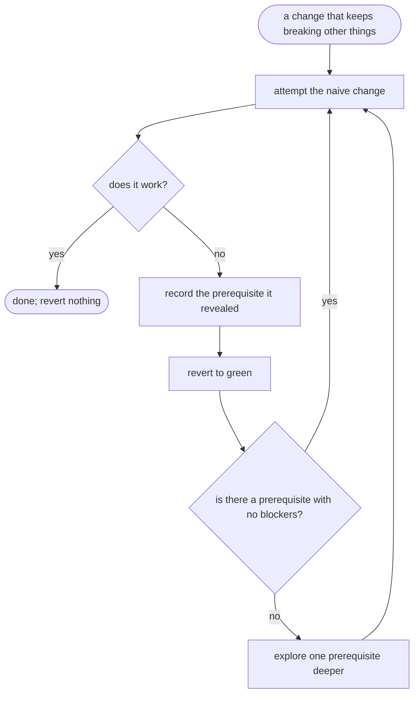

# mikado-graph — flow

## Gate evidence

| Gate | Kind | Evidence |
|---|---|---|
| G_WORKS | agent | SKILL.md: the build/test result decides, and the revert is unconditional on failure |
| G_LEAF | agent | SKILL.md's graph rule — always work a leaf, never a blocked node |
