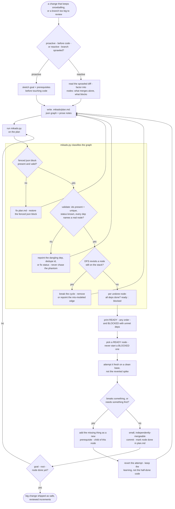

# mikado-graph — flow

Naive attempt, revert on discovery: each break becomes a prerequisite node, not a
patched-around obstacle. The engine (`mikado.py`) refuses a malformed graph outright -
a bad fence, an invalid node, a dangling dependency, or a cycle - so the agent is never
routed to work a phantom or blocked node. Only ready leaves are ever attempted, on a
clean base, and each is re-implemented fresh rather than salvaged from the reverted
spike. Source: `shared/skills/mikado-graph/SKILL.md`; engine:
`shared/skills/mikado-graph/scripts/mikado.py`.

## Gate evidence

| Gate | Kind | Evidence |
|---|---|---|
| G_MODE | agent | no eval covers this; SKILL.md's `## Proactive vs reactive` section names the two entry points |
| G_PARSE | code | `shared/skills/mikado-graph/scripts/mikado.py::def parse_graph` |
| G_VALID | code | `shared/skills/mikado-graph/scripts/mikado.py::def validate` |
| G_CYCLE | code | `shared/skills/mikado-graph/scripts/mikado.py::def classify` - the cycle branch is exercised by its `shared/skills/mikado-graph/scripts/mikado.py::cycle detected` self-test case |
| G_BREAKS | agent | `evals/mikado-graph/evals.json::REVERTS the half-done attempt (the Mikado move) rather than pushing through the breakage` |
| G_MORE | agent | no eval covers this; SKILL.md's leaf-first loop - "Repeat to the root." |
