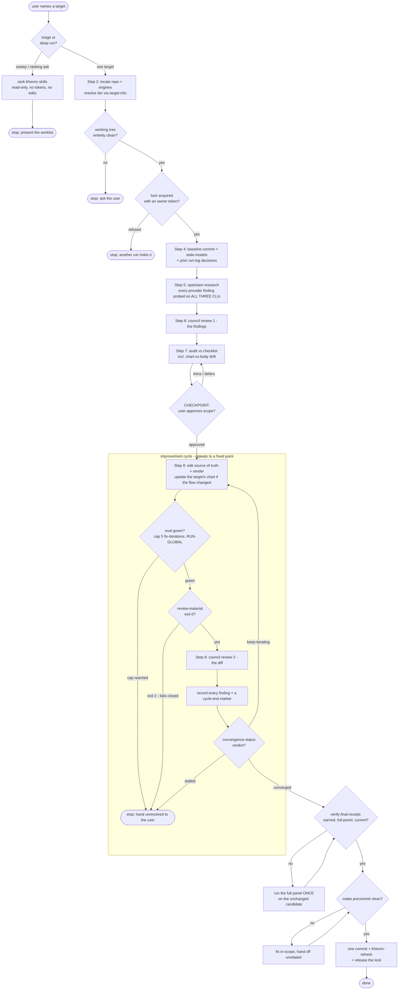

# skill-tuneup — flow

One deep target per run: baseline → research → council review 1 → audit → CHECKPOINT →
apply → eval → council review 2 → converge → ship. A read-only triage mode ranks and
stops instead. Source: `shared/skills/skill-tuneup/SKILL.md`.

## Gate evidence

| Gate | Kind | Evidence |
|---|---|---|
| G_MODE | agent | `evals/skill-tuneup/evals.json::Refuses to deep-tune every skill in one run` |
| G_CLEAN | agent | no eval covers this; SKILL.md Step 2 clean-tree rule — shipping stages with `git add -A`, so any unrelated edit would be swept into the tune-up commit |
| G_LOCK | code | `shared/skills/skill-tuneup/scripts/tuneup.py::def lock_acquire` |
| G_CHECK | agent | `evals/skill-tuneup/evals.json::Proposes the change as a checkpoint finding` |
| G_EVAL | code | `scripts/eval_harness.py::gate_ok` — the delta gate itself; the cap-5 rule beside it is an agent rule (SKILL.md non-negotiable) |
| G_MAT | code | `shared/skills/skill-tuneup/scripts/tuneup.py::def review_material` — exits 2 on a git error rather than returning "", because an empty result is what tells Step 9 there is nothing to review |
| G_CONV | code | `shared/skills/skill-tuneup/scripts/tuneup.py::a clean final cycle converges` |
| G_RECEIPT | code | `shared/skills/skill-tuneup/scripts/tuneup.py::def verify_final_receipt` |
| G_PRE | code | `Makefile::precommit` |
