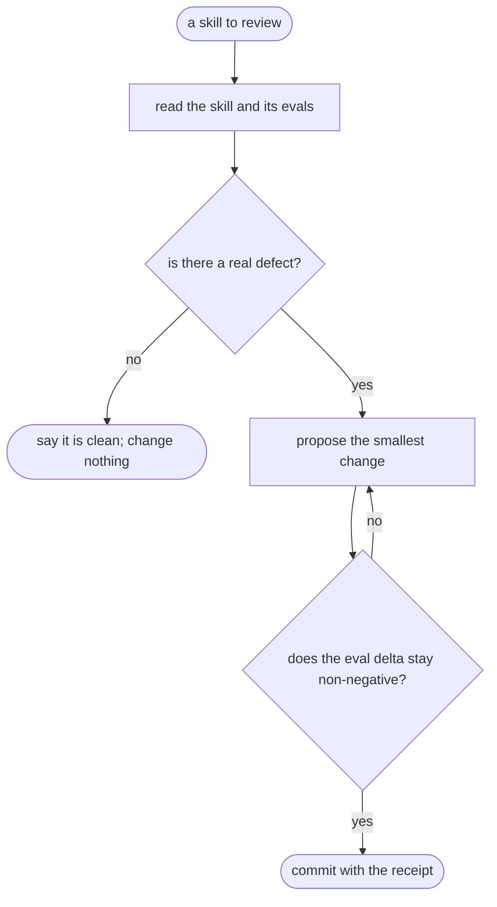

# skill-tuneup — flow

## Gate evidence

| Gate | Kind | Evidence |
|---|---|---|
| G_DEFECT | agent | SKILL.md: a clean pass stated plainly beats a manufactured caveat |
| G_EVAL | code | `scripts/eval_harness.py::def main` |
