# skill-tuneup — flow

One deep target per run: baseline → research → council review 1 → contract-cell audit →
CHECKPOINT → apply → applicable target gate + raw regrade → council review 2 →
independent reproduction → converge → ship. Triage ranks and stops instead. Source: `shared/skills/skill-tuneup/SKILL.md`.

```mermaid
flowchart TD
    accTitle: skill-tuneup deep-run flow
    accDescr: One skill per run - baseline, upstream research on every available CLI, two council reviews, a user checkpoint, the applicable target gate, severity-gated convergence, then ship. Triage ranks and stops.

    START([user names a target]) --> G_MODE{triage or<br/>deep run?}
    G_MODE -- "sweep / ranking ask" --> TRIAGE[rank khenrix skills<br/>refuse source conflicts; no edits] --> STOP_T([stop: present the worklist])
    G_MODE -- "one target" --> LOCATE[Step 2: locate repo + engines<br/>resolve tier via target-info]
    LOCATE --> G_CLEAN{working tree<br/>entirely clean?}
    G_CLEAN -- no --> HALT_D([stop: ask the user])
    G_CLEAN -- yes --> G_LOCK{lock acquired<br/>with an owner token?}
    G_LOCK -- refused --> HALT_L([stop: another run holds it])
    G_LOCK -- yes --> BASE[Step 4: baseline commit + stale-models<br/>+ prior run-log decisions]
    BASE --> RESEARCH[Step 5: upstream research<br/>every provider finding probed on available CLIs]
    RESEARCH --> COUNCIL1[Step 6: council review 1 - the findings]
    COUNCIL1 --> AUDIT[Step 7: audit vs checklist<br/>changed contracts: Mikado leaves + cell/probe matrix]
    AUDIT --> G_CHECK{CHECKPOINT:<br/>user approves scope?}
    G_CHECK -- "trims / defers" --> AUDIT

    subgraph CYCLE [improvement cycle - repeats to a fixed point]
        APPLY[Step 8: edit target source of truth<br/>full-gate: render + chart upkeep]
        APPLY --> G_VALID{all discovered runtime validators<br/>rerun after this edit?}
        G_VALID -- "red: caused by this run" --> FIXV[fix in-scope] --> APPLY
        G_VALID -- "red: unrelated" --> DEFERV[report + log deferred<br/>continue unchanged] --> G_CYCLE_TIER
        G_VALID -- "green / absent" --> G_CYCLE_TIER{resolved tier?}
        G_CYCLE_TIER -- full-gate --> G_TARGET_GATE{requires deterministic<br/>gate for TARGET?}
        G_TARGET_GATE -- yes --> G_DET{named make-eval certifier + evidence green?<br/>llm-council: smoke + council-test too}
        G_TARGET_GATE -- no --> G_EVAL{judge eval green?<br/>cap 5 fix-iterations, RUN-GLOBAL}
        G_CYCLE_TIER -- council-only --> G_NATIVE{target tests + hooks<br/>green or absent?}
        G_NATIVE -- "red: caused by this run" --> FIXN[fix in-scope] --> APPLY
        G_NATIVE -- "red: unrelated" --> DEFERN[report + log deferred<br/>continue unchanged] --> G_MAT
        G_NATIVE -- "green / absent" --> G_MAT
        G_EVAL -- "red: below cap" --> FIXE[classify + fix] --> APPLY
        G_EVAL -- "cap reached" --> HAND([stop: hand unresolved to the user])
        G_EVAL -- green --> G_RAW{mapped raw eval answers regraded<br/>or UNINSPECTED dispositioned?}
        G_DET -- "red: below cap" --> FIXE
        G_DET -- "cap reached" --> HAND
        G_DET -- green --> G_RAW
        G_RAW -- "false green / incomplete" --> FIXE
        G_RAW -- yes --> G_MAT{review-diff<br/>result?}
        G_MAT -- "exit 2 - fails closed" --> HAND
        G_MAT -- "empty: nothing changed" --> RECORD
        G_MAT -- "non-empty prompt" --> COUNCIL2[Step 9: council review 2 - the diff]
        COUNCIL2 --> REPRO[coordinator independently execute/trace claims<br/>label evidence + atomize + list unprobed]
        REPRO --> RECORD[record every finding + a cycle-end marker]
        RECORD --> G_CONV{convergence-status<br/>verdict?}
        G_CONV -- keep-iterating --> APPLY
        G_CONV -- stalled --> STALL_TERM[append deferred, converged:false<br/>run-convergence] --> HAND
        G_CONV -- ambiguous-log --> G_AMBIG{exact OPEN pre-start<br/>run_gap emitted?}
        G_AMBIG -- yes --> G_GAP{any pre-start occurrences<br/>belong to this run?}
        G_GAP -- yes --> RELOG[re-record current ordinary occurrences;<br/>use bound serious surrogates for lifecycle debt] --> RESOLVE_R[append exact v3 gap resolution<br/>partitioning every index prior/current] --> APPLY
        G_GAP -- "no: all verified prior history" --> RESOLVE_P[append exact v3 gap resolution<br/>with every index classified prior] --> G_CONV
        G_AMBIG -- "no: closed window / terminal tail / no active run" --> START_NEXT[append run-start before<br/>any next-run finding]
    end

    START_NEXT --> RESTART([next run: restart at Step 4 baseline])
    G_CHECK -- approved --> APPLY
    G_CONV -- converged --> G_SHIP_TIER{resolved tier?}
    G_SHIP_TIER -- full-gate --> G_RECEIPT{verify-final-receipt:<br/>earned, panel-or-self-test, current?}
    G_RECEIPT -- no --> G_GATE_KIND{requires deterministic<br/>gate for target?}
    G_GATE_KIND -- no --> PANEL[run the canonical panel ONCE<br/>on the unchanged candidate] --> G_RECEIPT
    G_GATE_KIND -- yes --> SUITE[run make eval once<br/>to earn the deterministic receipt] --> G_RECEIPT
    G_RECEIPT -- yes --> STAGE[recheck status + stage everything<br/>while run remains open] --> G_PRE{make precommit clean?}
    G_PRE -- "no: in-scope fix" --> FIXPRE[fix in-scope] --> APPLY
    G_PRE -- "no: unrelated" --> HAND
    G_PRE -- yes --> TERMINAL[append run-convergence as FINAL bookkeeping<br/>+ stage the run log]
    G_SHIP_TIER -- council-only --> FOREIGN_FINAL[recheck status + stage target<br/>native gate remains clean] --> TERMINAL
    TERMINAL --> G_TERMINAL{terminal parses, convergence still green<br/>+ staged diff check clean?}
    G_TERMINAL -- no --> HAND
    G_TERMINAL -- yes --> G_COMMIT_TIER{resolved tier?}
    G_COMMIT_TIER -- full-gate --> SHIP[one commit + khenrix-refresh<br/>+ release the lock] --> DONE([done])
    G_COMMIT_TIER -- council-only --> SHIP_F[commit target + run log separately<br/>state: no khenrix receipt + release lock] --> DONE
```

## Gate evidence

| Gate | Kind | Evidence |
|---|---|---|
| G_MODE | agent | `evals/skill-tuneup/evals.json::Refuses to deep-tune every skill in one run` |
| G_CLEAN | agent | no eval covers this; SKILL.md Step 2 clean-tree rule — shipping stages with `git add -A`, so any unrelated edit would be swept into the tune-up commit |
| G_LOCK | code | `shared/skills/skill-tuneup/scripts/tuneup.py::def lock_acquire` |
| G_CHECK | agent | `evals/skill-tuneup/evals.json::Treats the model hit as a checkpoint proposal rather than an automatic edit` |
| G_VALID | agent | `evals/skill-tuneup/evals.json::After every edit, including a later-cycle fix` |
| G_CYCLE_TIER | code | `shared/skills/skill-tuneup/scripts/tuneup.py::def target_info` |
| G_TARGET_GATE | code | `scripts/lib/checks.py::def requires_deterministic_gate` — routes by target, never receipt contents |
| G_DET | code | `scripts/eval_harness.py::def _write_receipt` — `make eval` runs the target's named certifier and records its evidence |
| G_EVAL | code | `scripts/eval_harness.py::gate_ok` — the delta gate itself; the cap-5 rule beside it is an agent rule (SKILL.md non-negotiable) |
| G_RAW | agent | `evals/skill-tuneup/evals.json::Regrades every eval case mapped to a changed contract` |
| G_NATIVE | agent | `evals/skill-tuneup/evals.json::Before council review #2 and convergence` |
| G_MAT | code | `shared/skills/skill-tuneup/scripts/tuneup.py::review-material returns exactly empty for an unchanged candidate`, `shared/skills/skill-tuneup/scripts/tuneup.py::review sizing and fanout use the exact same captured module`, and `shared/skills/skill-tuneup/scripts/tuneup.py::def run_diff_review` — unchanged, reviewable, and failed results remain distinct; the exact captured reviewer sizes and executes the fanout |
| G_CONV | code | `shared/skills/skill-tuneup/scripts/tuneup.py::a clean final cycle converges` |
| G_AMBIG | code | `shared/skills/skill-tuneup/scripts/tuneup.py::def convergence_status` — distinguishes an exact `run_gap` from a terminal tail whose remedy is a new `run-start` |
| G_GAP | agent | `evals/skill-tuneup/evals.json::For an ambiguous pre-start gap` — exact marker validation is additionally code-enforced by `shared/skills/skill-tuneup/scripts/tuneup.py::def _validate_run_gap_resolution` |
| G_SHIP_TIER | code | `shared/skills/skill-tuneup/scripts/tuneup.py::def target_info` |
| G_RECEIPT | code | `shared/skills/skill-tuneup/scripts/tuneup.py::def verify_final_receipt` — validates an existing receipt; missing or corrupt evidence fails closed |
| G_GATE_KIND | code | `scripts/lib/checks.py::def requires_deterministic_gate` — routes by target even before a receipt exists; `is_self_test_gated` validates existing receipt evidence only |
| G_PRE | code | `Makefile::precommit` |
| G_TERMINAL | code | `shared/skills/skill-tuneup/scripts/tuneup.py::def log_append` — validates terminal semantics; `convergence-status` and staged diff checks run after its final append |
| G_COMMIT_TIER | code | `shared/skills/skill-tuneup/scripts/tuneup.py::def target_info` |
