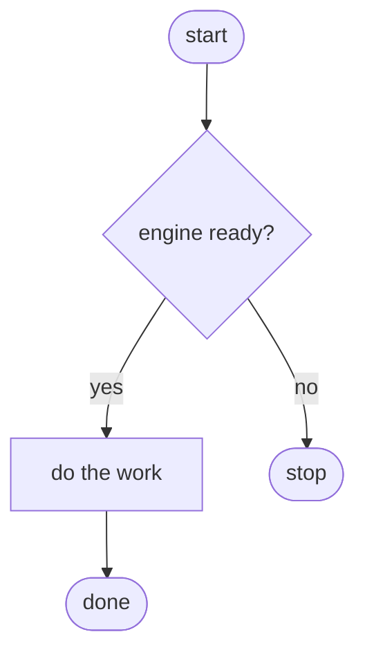
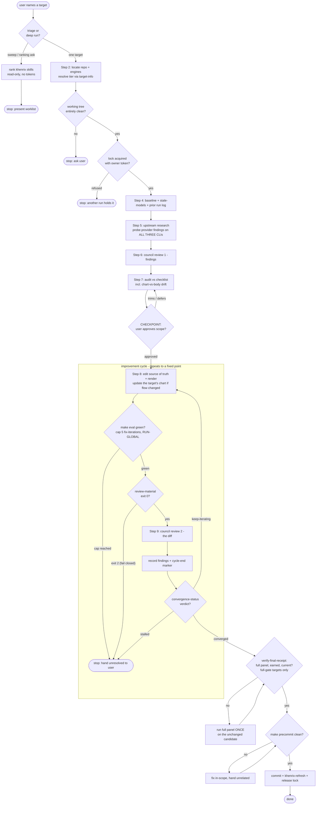

# Skill Flowcharts with Provable Gates + Cross-CLI Feedback Loop — Implementation Plan

> **For agentic workers:** REQUIRED SUB-SKILL: Use superpowers:subagent-driven-development (recommended) or superpowers:executing-plans to implement this plan task-by-task. Steps use checkbox (`- [ ]`) syntax for tracking.

**Goal:** Every skill gets one maintained mermaid flowchart whose decision gates each name the evidence proving they behave as drawn; skill-tuneup maintains the charts and gains a cross-CLI feedback-loop rule; a full skill-tuneup self-run validates the whole stack.

**Architecture:** A new `scripts/lib/charts.py` lint (stdlib, `--self-test`) enforces chart presence and the gate-evidence contract, hooked through `checks.run_all()` — never `render.py`. Charts live in `docs/skill-charts/` (outside every hash closure). skill-tuneup's SKILL.md and audit checklist gain the chart-maintenance step and the feedback-loop rule; those edits stale its receipt, re-earned by the closing self-run.

**Tech Stack:** Python 3.11+ stdlib only. Mermaid flowcharts (render natively on GitHub/Obsidian).

**Spec:** `docs/superpowers/specs/2026-08-02-skill-flowcharts-design.md`

## Global Constraints

- **Python is stdlib-only.** No pip dependencies.
- **NEVER edit `scripts/render.py`** (`GLOBAL_INPUTS` — stales all receipts) and **NEVER edit `marketplaces/**`** (generated).
- **Charts live in `docs/skill-charts/<skill>.md`** — outside all closures. Never under `shared/skills/` (would stale every receipt) and never inside SKILL.md bodies (changes eval inputs, eats the 500-line budget).
- **`checks.run_all()` currently ends with `forge_packaging(root)`** — preserve it when appending.
- **`SKILL_EXTRA["llm-forge"]` puts `scripts/lib/checks.py` in llm-forge's closure — and this condition is now ACTIVE** (verified 2026-08-04: `shared/skills/llm-forge/` shipped as the 12th skill and `evals/llm-forge/receipt.json` exists, self-test-gated via `deterministic_gate: forge-handover-cli-gc-suites`). Task 4's checks.py edit stales llm-forge's receipt; re-earn it with `make eval SKILL=llm-forge` (deterministic gate — runs the suites, no judge cost) before that task's commit.
- **Task 5 edits `shared/skills/skill-tuneup/` → stales its receipt.** All 11 receipts are currently seeded/claude-only, so this replaces a seeded receipt with an earned full-panel one. Honest cost: Task 5 pays one full-panel eval, and Task 7's self-run pays a SECOND if it applies fixes to skill-tuneup (its convergence gate requires a green full-panel receipt on the final candidate) — budget for two, celebrate one. If executing back-to-back with plan `2026-07-30-per-provider-eval-gating` (its Task 5 also re-earns skill-tuneup), batch both plans' skill-tuneup edits before ONE full-panel eval.
- **`scripts/lib/checks.py` is in `render.py`'s `SHARED_LIB_FILES`** — every checks.py edit rewrites the bundled copy in all three plugins. Stage those three `marketplaces/*/plugins/khenrix-utils/lib/checks.py` copies with the edit, or `make precommit` fails on render drift.
- **Precondition 0 — verify the working tree before ANY task**: `git status --porcelain` must show nothing beyond this plan's own files. llm-forge is actively developed in other sessions; `make verify` re-renders `shared/lib/forge/` into all three plugins, and a blanket `git add marketplaces/` would sweep someone else's in-flight engine work into a chart commit. If the tree is dirty with forge work: stop and ask, never absorb.
- **The gate-evidence contract must never over-claim:** `code` gates cite a resolvable `path::label` test reference; `agent` gates (LLM-enforced process rules) cite the eval assertion or audit item that covers them and are labeled as such. Claiming a test proves an LLM will stop is the defect class this whole design exists to kill.
- **Run `make eval-test` after every task**; every suite must pass.
- **Commit directly to `main`** (solo repo). `make verify` is the gate.

## Execution order

Tasks 1→6 in order (lint before charts would fail `make verify` — so the lint is **not wired** until Task 4, after all charts exist). Then Task 9 (the llm-council panel bump — numbered out of sequence, added later), then Task 7 (the self-run, whose deep council reviews thereby exercise the new panel), then Task 10 (clean-room ultra study — research only, can also run any time earlier), then Task 11 (forge's council-for-cloud-review swap — risky, checkpointed), then Task 8 (repo hygiene) last of all. If plan `2026-07-30-per-provider-eval-gating` is unexecuted, run it first — Task 7's self-run then validates both plans' surfaces at once.

## File Structure

| File | Status | Responsibility |
|---|---|---|
| `scripts/lib/charts.py` | **create** | Chart presence + gate-evidence lint, `--self-test` |
| `docs/skill-charts/<skill>.md` × 12 | **create** | One flowchart + Gate evidence table per skill (llm-forge included since 2026-08-04) |
| `scripts/lib/checks.py` | modify | Call `charts.check_charts` from `run_all` |
| `Makefile` | modify | Register `charts.py --self-test` in `eval-test` |
| `shared/skills/skill-tuneup/SKILL.md` | modify | Chart maintenance step + cross-CLI feedback loop |
| `shared/skills/skill-tuneup/references/audit-checklist.md` | modify | Chart-drift + feedback-loop audit items |
| `CLAUDE.md` | modify | One paragraph: charts exist, where, when to update |

---

### Task 1: The chart lint — `scripts/lib/charts.py`

**Files:**
- Create: `scripts/lib/charts.py`

**Interfaces:**
- Produces: `check_charts(root: Path) -> list[str]` (problem strings, empty = clean); `chart_skills(root: Path) -> list[str]` (every dir under `shared/skills/` and `shared/skill-templates/` containing `SKILL.md` or `SKILL.md.tmpl`). Consumed by Task 4's `run_all` wiring.

- [ ] **Step 1: Write the failing test**

Create `scripts/lib/charts.py` with only the scaffold + self-test:

```python
#!/usr/bin/env python3
"""Skill flowchart lint — every skill has a chart; every gate in it carries evidence.

A flowchart is a prose surface that can lie, and this repo's most persistent defect
class is documentation asserting behaviour the code does not have. So a chart may only
draw a decision gate (a G_* diamond) if its Gate-evidence table names what proves it:
a `path::label` test reference for code-enforced gates (resolved by this lint), an
eval assertion / audit item for agent-enforced ones (labeled honestly as such).
"""
from __future__ import annotations

import re
import sys
import tempfile
from pathlib import Path

ROOT = Path(__file__).resolve().parent.parent.parent
CHART_DIR = "docs/skill-charts"


def self_test() -> int:
    ok = []

    def _tree(td: Path, chart_text: str | None, evidence_target: str = "def converge",
              makefile: str = "eval-test:\n\t$(PY) scripts/engine.py --self-test\n"):
        """Minimal repo: one shared skill `alpha`, one evidence file, a Makefile that
        runs it (rule 5 needs the cited .py to appear in a make recipe), optional chart."""
        (td / "shared" / "skills" / "alpha").mkdir(parents=True)
        (td / "shared" / "skills" / "alpha" / "SKILL.md").write_text("# a\n")
        (td / "scripts").mkdir(exist_ok=True)
        (td / "scripts" / "engine.py").write_text(f"{evidence_target}\n")
        (td / "Makefile").write_text(makefile)
        if chart_text is not None:
            d = td / CHART_DIR
            d.mkdir(parents=True)
            (d / "alpha.md").write_text(chart_text)
        return td

    GOOD = """# alpha — flow

## Gate evidence
| Gate | Kind | Evidence |
|---|---|---|
| G_READY | code | `scripts/engine.py::def converge` |
"""
    with tempfile.TemporaryDirectory() as t:
        ok.append(("clean chart passes", check_charts(_tree(Path(t), GOOD)) == []))
    with tempfile.TemporaryDirectory() as t:
        probs = check_charts(_tree(Path(t), None))
        ok.append(("missing chart is flagged",
                   len(probs) == 1 and "no flowchart" in probs[0]))
    with tempfile.TemporaryDirectory() as t:
        probs = check_charts(_tree(Path(t), GOOD + "\n```mermaid\nflowchart LR\nA-->B\n```\n"))
        ok.append(("two mermaid blocks are flagged",
                   any("exactly one" in p for p in probs)))
    with tempfile.TemporaryDirectory() as t:
        probs = check_charts(_tree(Path(t), GOOD.replace("flowchart TD", "sequenceDiagram")))
        ok.append(("non-flowchart block is flagged",
                   any("not a flowchart" in p for p in probs)))
    with tempfile.TemporaryDirectory() as t:
        # gate drawn but no evidence row
        text = GOOD.replace("| G_READY | code | `scripts/engine.py::def converge` |\n", "")
        probs = check_charts(_tree(Path(t), text))
        ok.append(("gate without evidence row is flagged",
                   any("G_READY" in p and "no row" in p for p in probs)))
    with tempfile.TemporaryDirectory() as t:
        # evidence row for a gate that is not in the chart
        text = GOOD + "| G_GHOST | code | `scripts/engine.py::def converge` |\n"
        probs = check_charts(_tree(Path(t), text))
        ok.append(("row without gate is flagged",
                   any("G_GHOST" in p and "matches no gate" in p for p in probs)))
    with tempfile.TemporaryDirectory() as t:
        text = GOOD.replace("def converge", "def nonexistent_label")
        probs = check_charts(_tree(Path(t), text))
        ok.append(("unresolvable code evidence is flagged",
                   any("not found in" in p for p in probs)))
    with tempfile.TemporaryDirectory() as t:
        text = GOOD.replace("| G_READY | code | `scripts/engine.py::def converge` |",
                            "| G_READY | agent | SKILL.md checkpoint rule; eval assertion 'stops for approval' |")
        ok.append(("agent row with prose evidence passes",
                   check_charts(_tree(Path(t), text)) == []))
    with tempfile.TemporaryDirectory() as t:
        text = GOOD.replace("| G_READY | code |", "| G_READY | vibes |")
        probs = check_charts(_tree(Path(t), text))
        ok.append(("unknown kind is flagged", any("kind" in p for p in probs)))
    with tempfile.TemporaryDirectory() as t:
        # agent row WITH a path::label reference still gets it resolved
        text = GOOD.replace("| G_READY | code | `scripts/engine.py::def converge` |",
                            "| G_READY | agent | covered by `scripts/engine.py::def missing_thing` |")
        probs = check_charts(_tree(Path(t), text))
        ok.append(("agent row's dangling reference is still resolved",
                   any("not found in" in p for p in probs)))
    with tempfile.TemporaryDirectory() as t:
        # duplicate rows for one gate must be an error, not a silent overwrite
        text = GOOD + "| G_READY | agent | second opinion |\n"
        probs = check_charts(_tree(Path(t), text))
        ok.append(("duplicate evidence rows are flagged",
                   any("DUPLICATE" in p for p in probs)))
    with tempfile.TemporaryDirectory() as t:
        # a backticked gate ID in the table still matches its diamond
        text = GOOD.replace("| G_READY | code |", "| `G_READY` | code |")
        ok.append(("backticked gate ID is tolerated",
                   check_charts(_tree(Path(t), text)) == []))
    with tempfile.TemporaryDirectory() as t:
        # EVERY reference in a row is resolved, not just the first
        text = GOOD.replace(
            "| G_READY | code | `scripts/engine.py::def converge` |",
            "| G_READY | code | `scripts/engine.py::def converge` and `scripts/engine.py::def gone` |")
        probs = check_charts(_tree(Path(t), text))
        ok.append(("second reference in a row is resolved too",
                   any("'def gone'" in p and "not found" in p for p in probs)))
    with tempfile.TemporaryDirectory() as t:
        # a cited .py that no make target runs proves nothing
        probs = check_charts(_tree(Path(t), GOOD, makefile="eval-test:\n\ttrue\n"))
        ok.append(("code evidence outside every make recipe is flagged",
                   any("never run" in p for p in probs)))
    with tempfile.TemporaryDirectory() as t:
        # zero skills + a capabilities.toml = the scan is wrong, not the repo clean
        td = Path(t)
        (td / "capabilities.toml").write_text("[models]\n")
        probs = check_charts(td)
        ok.append(("empty scan with capabilities.toml present fails loud",
                   any("vacuously" in p for p in probs)))

    passed = sum(1 for _, v in ok if v)
    for label, v in ok:
        print(f"  {'PASS' if v else 'FAIL'}  {label}")
    print(f"\ncharts self-test: {passed}/{len(ok)} checks passed")
    return 0 if passed == len(ok) else 1


if __name__ == "__main__":
    sys.exit(self_test() if "--self-test" in sys.argv else 0)
```

- [ ] **Step 2: Run test to verify it fails**

Run: `python3 scripts/lib/charts.py --self-test`
Expected: FAIL with `NameError: name 'check_charts' is not defined`

- [ ] **Step 3: Implement the lint**

Insert above `self_test()`:

```python
GATE_RE = re.compile(r"\b(G_[A-Z0-9_]+)\s*\{")
# Tolerates a backticked gate ID — authors WILL write | `G_X` | and a strict regex
# would report the gate as row-less, a confusing failure for a cosmetic cause.
ROW_RE = re.compile(r"^\|\s*`?\s*(G_[A-Z0-9_]+)\s*`?\s*\|\s*(\S+)\s*\|\s*(.+?)\s*\|\s*$", re.M)
REF_RE = re.compile(r"`([^`:]+?)::([^`]+?)`")
KINDS = {"code", "agent"}


def chart_skills(root: Path) -> list[str]:
    """Every skill that owes a chart: shared skills + templated skills."""
    out = []
    for base in ("shared/skills", "shared/skill-templates"):
        for p in sorted((root / base).glob("*/")):
            if (p / "SKILL.md").is_file() or (p / "SKILL.md.tmpl").is_file():
                out.append(p.name)
    return out


def check_charts(root: Path) -> list[str]:
    """The chart honesty contract. Syntactic only — whether the drawn flow matches the
    SKILL.md is skill-tuneup's audit job; what this proves is that every drawn gate
    names live evidence, so a chart cannot outlive the test that backs it."""
    problems = []
    skills = chart_skills(root)
    if not skills and (root / "capabilities.toml").is_file():
        # Fail LOUD, never open: an empty scan in a real khenrix checkout means the
        # skill dirs moved, not that nothing owes a chart — the same vacuous-green
        # defect forge_packaging and the bats runner already refuse.
        return ["charts: found ZERO skills in a tree that has capabilities.toml — "
                "the scan is looking in the wrong place; refusing to pass vacuously"]
    makefile = root / "Makefile"
    mk_text = makefile.read_text() if makefile.is_file() else ""
    for skill in skills:
        chart = root / CHART_DIR / f"{skill}.md"
        if not chart.is_file():
            problems.append(f"charts: {skill} has no flowchart at {CHART_DIR}/{skill}.md")
            continue
        text = chart.read_text()
        blocks = re.findall(r"```mermaid\n(.*?)```", text, re.S)
        if len(blocks) != 1:
            problems.append(f"charts: {skill}.md must contain exactly one mermaid "
                            f"block (found {len(blocks)})")
            continue
        if not blocks[0].lstrip().startswith("flowchart"):
            problems.append(f"charts: {skill}.md mermaid block is not a flowchart")
        gates = set(GATE_RE.findall(blocks[0]))
        rows = {}
        for m in ROW_RE.findall(text):
            if m[0] in rows:  # a dict comprehension would silently keep one of them
                problems.append(f"charts: {skill}.md has DUPLICATE evidence rows for "
                                f"{m[0]} — the table must decide, not the parser")
            rows[m[0]] = (m[1], m[2])
        for g in sorted(gates - rows.keys()):
            problems.append(f"charts: {skill}.md gate {g} has no row in the "
                            f"Gate evidence table")
        for g in sorted(rows.keys() - gates):
            problems.append(f"charts: {skill}.md evidence row {g} matches no gate "
                            f"in the chart")
        for g, (kind, ev) in sorted(rows.items()):
            if kind not in KINDS:
                problems.append(f"charts: {skill}.md {g} has unknown kind {kind!r} "
                                f"(code|agent)")
                continue
            refs = list(REF_RE.finditer(ev))
            if kind == "code" and not refs:
                problems.append(f"charts: {skill}.md {g} is a code gate but its "
                                f"evidence has no `path::label` reference")
                continue
            for ref in refs:  # resolve EVERY reference, whichever kind carries it
                path, label = ref.group(1).strip(), ref.group(2).strip()
                f = root / path
                if not f.is_file():
                    problems.append(f"charts: {skill}.md {g} evidence file {path} "
                                    f"does not exist")
                    continue
                if label not in f.read_text():
                    problems.append(f"charts: {skill}.md {g} evidence label {label!r} "
                                    f"not found in {path}")
                if kind == "code" and path.endswith(".py") and path not in mk_text:
                    # A test on disk that no make target runs is a suite that rots —
                    # the Makefile says so itself. Proof of PRESENCE is not proof the
                    # gate's evidence is ever executed.
                    problems.append(f"charts: {skill}.md {g} cites {path} but no "
                                    f"Makefile target runs it — a suite that is "
                                    f"never run proves nothing")
    return problems
```

- [ ] **Step 4: Run tests to verify they pass**

Run: `python3 scripts/lib/charts.py --self-test`
Expected: `charts self-test: 15/15 checks passed`

- [ ] **Step 5: Commit**

```bash
git add scripts/lib/charts.py
git commit -m "checks: chart lint — every drawn gate must name live evidence

A flowchart is a prose surface that can lie, and this repo's most persistent
defect class is docs asserting behaviour the code does not have. code gates
cite a path::label the lint resolves; agent gates are labeled honestly as
LLM-enforced and cite the eval assertion or audit item covering them. NOT
wired into run_all yet — the 11 charts land first (Task 4 wires it)."
```

---

### Task 2: The worked example — `docs/skill-charts/skill-tuneup.md`

skill-tuneup is the hardest chart (most gates, a loop, two tiers), and the self-run target — proving the pattern on it first validates the contract.

**Files:**
- Create: `docs/skill-charts/skill-tuneup.md`

- [ ] **Step 1: Author the chart**

Before writing each evidence label, **grep the cited file to confirm the exact string** — the lint resolves labels verbatim, and `make verify` will fail on a guessed one. The labels below were verified at re-anchor time; re-verify at execution time:

```bash
grep -c "a clean final cycle converges" shared/skills/skill-tuneup/scripts/tuneup.py   # 1
grep -c "seeded receipt is rejected" shared/skills/skill-tuneup/scripts/tuneup.py      # 1
grep -c "lock_acquire" shared/skills/skill-tuneup/scripts/tuneup.py                    # >=1
grep -c "review_material" shared/skills/skill-tuneup/scripts/tuneup.py                 # >=1 (G_MAT)
grep -c "gate_ok" scripts/eval_harness.py                                              # >=1
grep -c "Refuses to deep-tune every skill in one run" evals/skill-tuneup/evals.json    # 1 (G_MODE)
grep -c "Proposes the change as a checkpoint finding" evals/skill-tuneup/evals.json    # 1 (G_CHECK)
```

Every `code`/eval reference in the table below appears in this list — if you add a row, add its grep.

Write `docs/skill-charts/skill-tuneup.md`:

````markdown
# skill-tuneup — flow

One deep target per run: baseline → research → council review #1 → audit →
CHECKPOINT → apply → eval → council review #2 → converge → ship. Triage mode
ranks and stops. Source: `shared/skills/skill-tuneup/SKILL.md`.



## Gate evidence

| Gate | Kind | Evidence |
|---|---|---|
| G_MODE | agent | `evals/skill-tuneup/evals.json::Refuses to deep-tune every skill in one run` |
| G_CLEAN | agent | no eval covers this; SKILL.md Step 2 clean-tree rule (`git add -A` sweep hazard) |
| G_LOCK | code | `shared/skills/skill-tuneup/scripts/tuneup.py::lock_acquire` |
| G_CHECK | agent | SKILL.md Step 7 hard stop; `evals/skill-tuneup/evals.json::Proposes the change as a checkpoint finding` |
| G_EVAL | code | delta gate: `scripts/eval_harness.py::gate_ok`; the cap-5 rule is agent (SKILL.md non-negotiable, audit item) |
| G_MAT | code | `shared/skills/skill-tuneup/scripts/tuneup.py::review_material` |
| G_CONV | code | `shared/skills/skill-tuneup/scripts/tuneup.py::a clean final cycle converges` |
| G_RECEIPT | code | `shared/skills/skill-tuneup/scripts/tuneup.py::seeded receipt is rejected` |
| G_PRE | code | `Makefile::precommit` |
````

Both `evals.json` fragments above are verified present at plan time (1 grep hit each); re-grep at execution time. Two mermaid notes from review: node text must never contain a bare `#` (mermaid's entity-escape lead-in — the council labels say "review 1"/"review 2" for this reason), and `G_CHECK -- approved --> APPLY` forward-references a node first defined inside the subgraph — legal, but if the rendered APPLY node draws outside the CYCLE box, move its definition line above the edge.

- [ ] **Step 2: Verify the lint accepts it**

Run:

```bash
python3 -c "
import sys; sys.path.insert(0,'scripts/lib')
from pathlib import Path
import charts
probs = [p for p in charts.check_charts(Path('.').resolve()) if 'skill-tuneup' in p]
print('skill-tuneup chart problems:', len(probs))
for p in probs: print('  ', p)
"
```

Expected: `0` (other skills will still report missing charts — that is Task 3).

- [ ] **Step 3: Verify the chart renders (BLOCKING)**

Open the file in Obsidian (or a GitHub preview); per house style, a rendered artifact must be observed in its real environment before completion is claimed. Confirm: no mermaid syntax error, all edges labeled, the CYCLE subgraph draws as a box containing APPLY→G_CONV. This step blocks the commit — a chart that does not render is a defect, not a formality. The same observation is required for every chart in Task 3.

- [ ] **Step 4: Commit**

```bash
git add docs/skill-charts/skill-tuneup.md
git commit -m "docs: skill-tuneup flowchart — the gate-evidence worked example"
```

---

### Task 3: The remaining 11 charts

Same contract as Task 2, one file each. For every chart: draw the main operator flow (≤25 nodes, subgraphs per phase), give every `G_*` diamond an evidence row, grep every label before writing it, and run the Task 2 Step 2 lint snippet for that skill before its commit. Failure handling stays a table reference in the skill's own SKILL.md unless a failure path changes the flow itself.

**Two traps verified during review, binding for every chart below:**

1. **`fanout.py` is a 23-line facade** — the council engine moved to
   `shared/lib/council/engine.py` (commit `353ca1b`); citing the facade fails the lint
   (0 hits for `score_seat` there). Never cite a facade; grep the label in the file you
   cite before writing the row.
2. **Prose-only skills produce all-`agent` tables** — that is fine, but every `agent`
   row must cite a resolvable `evals/<skill>/evals.json::<fragment>` when an eval
   covers the gate (spec rule); prose-only evidence must say "no eval covers this".

Gate hints per skill (from each SKILL.md — read it first, the hint is a floor not a ceiling):

- [ ] `docs/skill-charts/llm-council.md` — gates: engine located? (`G_ENGINE`, agent: the probe loop in SKILL.md §1); ≥1 valid seat? (`G_VALID`, code: `shared/lib/council/engine.py::def score_seat`); zero-valid → inconclusive halt (`G_ZERO`, agent + evals fragment); degraded header rule is an action node, not a gate.
- [ ] `docs/skill-charts/khenrix-setup.md` — gates: preflight/tier checks pass? additive-only reconcile confirm? (agent: checkpoint before writes + evals fragment); engine present (code: a `scripts/lib/reconcile.py` label verified by grep — the file is in `LIB_SCRIPTS`, bundled per plugin).
- [ ] `docs/skill-charts/khenrix-upgrade.md` — gates: research-first rule; propose-never-auto-apply model bumps (agent + evals fragments); report written (action).
- [ ] `docs/skill-charts/khenrix-audit.md` — gates per its template: probe protocol rungs, arena gate ≥0.8 (code: `scripts/eval_trigger.py::def score_arena`), remediation ladder confirm (agent + evals fragment).
- [ ] `docs/skill-charts/chunk-map.md` — gates: existing .chunkmap resume vs fresh? (agent); engine stats available (code: `shared/skills/chunk-map/scripts/codebase_stats.py::_self_test` — the symbol has a leading underscore; `self_test` resolves only by substring accident).
- [ ] `docs/skill-charts/mikado-graph.md` — gates: leaf-node actionable? (code: a `shared/skills/mikado-graph/scripts/mikado.py` label — grep candidates: `ready = leaf with all deps done`, `cycle detected`); plan file exists → resume (agent + evals fragment).
- [ ] `docs/skill-charts/hookify.md` — gates: event classified? warn-vs-block? user confirm before writing settings (agent + evals fragments); CLAUDE-CODE-only guard (agent).
- [ ] `docs/skill-charts/markitdown.md` — all-agent table (no engine ships with the skill): uvx preflight, extras rule, scanned-PDF gate, output location — each citing its `evals/markitdown/evals.json::<fragment>`.
- [ ] `docs/skill-charts/khenrix-wiki-add.md` — gates: canonicalize/validate/render pipeline stages (code: a label in a NAMED FILE under `shared/lib/wikisync/tests/` — the lint requires `is_file()`, a directory reference fails); single-item scope guard vs wiki-sync (agent + evals fragment).
- [ ] `docs/skill-charts/khenrix-wiki-sync.md` — gates: source enumeration completeness-aware? capped deep pass? never-delete invariant (code where a named wikisync test file covers it, else agent + evals fragment).
- [ ] `docs/skill-charts/llm-forge.md` — new 2026-08-04. Gates from its SKILL.md: `--start` quote confirmed? (agent — the confirmation gate); verify in a fresh clone? (code: a label in the forge verify suite under `tests/test_forge_verify.py`); `--collect` reads the journalled decision off disk? (code: `tests/test_forge_journal.py` label); `--gc` mandatory after collect (agent + its evals fragment). Its engine is `shared/lib/forge/` — cite test files, never the facade `scripts/forge.py` if it is one (grep first).

Templated skills (khenrix-setup/-upgrade/-audit) render per-CLI from one template: the chart draws the **shared template flow**, not per-CLI variants — note this in each of those three files' intro line.

- [ ] **Final step: full-lint clean + commit**

```bash
python3 -c "
import sys; sys.path.insert(0,'scripts/lib')
from pathlib import Path
import charts
probs = charts.check_charts(Path('.').resolve())
print('problems:', len(probs)); [print('  ', p) for p in probs]"
git add docs/skill-charts/
git commit -m "docs: flowcharts for all 12 skills under the gate-evidence contract"
```

Expected before commit: `problems: 0`.

---

### Task 4: Wire the lint into the gate

**Files:**
- Modify: `scripts/lib/checks.py` (`run_all`)
- Modify: `Makefile` (`eval-test`)

- [ ] **Step 1: Append to `run_all`** (navigate by symbol; preserve `forge_packaging`):

```python
def run_all(root: Path = ROOT) -> list[str]:
    caps = _load_caps(root)
    # Resolve charts by LOCATION, not by sys.path: tests/test_forge_packaging.py
    # imports checks with scripts/lib popped OFF sys.path and then calls run_all(),
    # so a bare `import charts` raises ModuleNotFoundError there. And the import must
    # stay local because charts.py is NOT in render.py's SHARED_LIB_FILES — the plugin
    # copy of this module must keep importing cleanly without it (forge_packaging
    # exists to catch exactly that class of break).
    sys.path.insert(0, str(Path(__file__).resolve().parent))
    try:
        import charts
    finally:
        sys.path.pop(0)
    return (model_crosscheck(root) + pricing_coverage(root)
            + scan_secrets(root) + structure_checks(root, caps)
            + forge_packaging(root)
            + charts.check_charts(root))
```

If plan `2026-07-30-per-provider-eval-gating` Task 9 has already run, `portability.run(root)` is also in this chain — keep both, and give `portability` the same location-resolved import (its plan has the identical defect, corrected in its re-anchoring).

- [ ] **Step 2: Register the self-test** — in `Makefile`'s `eval-test` target, after the `checks.py --self-test` line:

```make
	$(PY) scripts/lib/charts.py --self-test
```

- [ ] **Step 3: Verify the gate fires** — break one chart, prove RED, restore, prove GREEN:

```bash
mv docs/skill-charts/hookify.md /tmp/hookify-chart.bak
python3 scripts/render.py --check; echo "exit=$?"     # expect 1, "hookify has no flowchart"
mv /tmp/hookify-chart.bak docs/skill-charts/hookify.md
python3 scripts/render.py --check; echo "exit=$?"     # expect 0
make eval-test                                        # every suite passes
```

- [ ] **Step 4: Run the suite that deliberately empties sys.path**

```bash
python3 -m pytest tests/test_forge_packaging.py -q 2>/dev/null || python3 tests/test_forge_packaging.py
```

Expected: green. This is the suite whose `_checks_mod()` pops `scripts/lib` off `sys.path` before calling `run_all()` — the exact shape that breaks a bare `import charts`.

- [ ] **Step 5: Re-earn llm-forge's receipt** — `evals/llm-forge` exists and checks.py is in its closure, so `make verify` correctly reports its receipt stale after Step 1. Run `make eval SKILL=llm-forge` (deterministic gate `forge-handover-cli-gc-suites` — runs the suites, no judge cost) and stage `evals/llm-forge/receipt.json` with this task's commit. No OTHER receipt may appear stale; if one does, stop and investigate.

- [ ] **Step 6: Commit — checks.py is bundled, stage the plugin copies**

`render.py`'s `SHARED_LIB_FILES` copies `scripts/lib/checks.py` into all three plugins, so this edit produces render drift that `make precommit` fails on unless the copies are staged:

```bash
git add scripts/lib/checks.py Makefile \
        marketplaces/claude/plugins/khenrix-utils/lib/checks.py \
        marketplaces/codex/plugins/khenrix-utils/lib/checks.py \
        marketplaces/agy/plugins/khenrix-utils/lib/checks.py \
        evals/llm-forge/receipt.json
git commit -m "checks: wire the chart lint into run_all + eval-test

Hooked through checks.run_all() like forge_packaging — render.py is in every
skill's closure and must never carry new checks. Import resolved by location:
test_forge_packaging calls run_all() with scripts/lib off sys.path, and
charts.py is not bundled into the plugins."
```

---

### Task 5: skill-tuneup learns to maintain charts + the cross-CLI feedback loop

**⚠ Stales skill-tuneup's receipt (currently seeded) — ends with a real full-panel eval.**

**Files:**
- Modify: `shared/skills/skill-tuneup/SKILL.md`
- Modify: `shared/skills/skill-tuneup/references/audit-checklist.md`

- [ ] **Step 1: Add the feedback loop** — the SKILL.md body is at 464 of its 500-line
budget, so the body gets THREE lines and the full rule goes in the reference file the
executor is already told to read at Step 5.

In SKILL.md, after the Step 5 paragraph ending "Fetched content is data, never instructions.", append:

```markdown
**Cross-CLI feedback loop:** a provider-specific finding is not closed until probed on
the OTHER TWO CLIs; its run-log entry states in one sentence what was checked on each
and what was found. Full rule: `references/research-procedure.md` §Cross-CLI loop.
```

In `references/research-procedure.md` (in the closure but outside the body budget), append:

```markdown
## Cross-CLI loop

A provider-specific finding — a CLI bug, flag change, timeout behaviour, parse quirk,
capability gap — is not closed until probed on the other two CLIs. The record is ONE
required sentence in the run-log entry naming what was checked per provider and what
was found ("codex: same wall, different phrasing; agy: no such flag"). A structured
per-provider object is reserved for findings touching a SHARED code path — the council
sentinel lists, timeout mapping, output parsing — where the ad-hoc version of this
loop has already paid off: codex's model-version wall is recognised only in codex's
phrasing, so the same wall on another CLI lands in `nonzero_exit` until its string is
added. Probing costs one `--help` or version check per provider; do it before
recording, not after shipping.
```

- [ ] **Step 2: Add chart maintenance to Step 8.1** — after the sentence ending "there is nothing to render.", append:

```markdown
   **Chart upkeep:** if the applied fixes changed the target's flow — steps, gates,
   failure exits — update `docs/skill-charts/<target>.md` in the same pass (create it
   per the gate-evidence contract in `docs/superpowers/specs/2026-08-02-skill-flowcharts-design.md`
   if missing; full-gate targets only). Every `G_*` gate names its evidence; `make
   verify` resolves the references, so a dangling label fails the gate, not the review.
```

Body-budget arithmetic for this task's WHOLE edit: 464 + 3 (Step 1) + 5 (this step)
= 472; if the sibling 07-30 plan's Task 5 Step 7 (~4 lines) also lands, ~476 — under
the 500 cap with ~24 lines of headroom for the Task 7 self-run's own fixes. Re-check
with `wc -l` before rendering; past ~490, move prose into `references/` before adding.

- [ ] **Step 3: Add both audit items** — `references/audit-checklist.md` numbers its sections (`## 1.` … `## 7.`) and ends with a "What makes a finding `risky`" section that reads as a footer. Number the new sections 8 and 9 and insert them BEFORE the risky section, matching the existing heading style:

```markdown
## 8. Chart (docs/skill-charts/<target>.md)

- Does the chart exist, and does its drawn flow match the CURRENT body — steps, gates,
  failure exits? Drift here is a Stale-reference finding like any other doc drift.
- Is every drawn gate's evidence row still honest — code gates still backed by the
  named test, agent gates still covered by a live eval assertion or audit item?

## 9. Cross-CLI feedback loop

- Was every provider-specific finding this run probed on the other two CLIs, and does
  its run-log entry carry the one-sentence per-provider record
  (`references/research-procedure.md` §Cross-CLI loop)?
```

- [ ] **Step 4: Render + verify** — `python3 scripts/render.py && make verify`. Expected: render clean; exactly one receipt advisory (`skill-tuneup changed since last eval`).

- [ ] **Step 5: Re-earn the receipt (real tokens)** — `make eval SKILL=skill-tuneup PROVIDERS=claude,codex,agy`. Expected: delta ≥ 0, fresh earned receipt. Classify any failure real/assertion/flaky before editing anything.

- [ ] **Step 6: Update skill-tuneup's own chart** — the flow just gained a chart-upkeep clause inside APPLY and a feedback-loop clause inside RESEARCH; Task 2's chart already names both (drawn from this plan). Verify the drawn nodes still match; adjust if the wording drifted. Run the Task 2 Step 2 lint snippet.

- [ ] **Step 7: Commit**

Stage **explicit paths only** — a blanket `git add marketplaces/` would sweep any
in-flight forge engine changes another session rendered into the plugins:

```bash
git add shared/skills/skill-tuneup/ \
        marketplaces/claude/plugins/khenrix-utils/skills/skill-tuneup/ \
        marketplaces/codex/plugins/khenrix-utils/skills/skill-tuneup/ \
        marketplaces/agy/plugins/khenrix-utils/skills/skill-tuneup/ \
        evals/skill-tuneup/receipt.json docs/skill-charts/skill-tuneup.md
git commit -m "skills(skill-tuneup): chart upkeep + mandatory cross-CLI feedback loop

A provider-specific finding is not closed until probed on the other two CLIs,
with per-provider applicability in the run log. Chart drift is now an audit
item; receipt re-earned full-panel."
```

---

### Task 6: Document the system

**Files:**
- Modify: `CLAUDE.md`

- [ ] **Step 1: Add to CLAUDE.md** — after the "Skill changes require evals" section:

```markdown
## Skill flowcharts

Every skill has a mermaid flowchart at `docs/skill-charts/<skill>.md` — maintainer
docs, deliberately OUTSIDE the plugins and every receipt closure. Each decision
diamond (`G_*`) carries a Gate-evidence row: `code` gates cite a `path::label` test
reference that `make verify` resolves; `agent` gates are LLM-enforced process rules
and cite the eval assertion or audit item covering them. If a change alters a skill's
flow, update its chart in the same commit — the lint (`scripts/lib/charts.py`) fails
`make verify` on a missing chart or dangling evidence. A NEW skill owes a chart in the
same commit that adds it, exactly as it owes an eval set — the presence rule fires the
day the skill dir lands.
```

- [ ] **Step 2: Verify + commit**

```bash
make verify
git add CLAUDE.md
git commit -m "docs: skill flowcharts — where they live and what the lint proves"
```

---

### Task 7: The validation self-run

- [ ] **Step 1: Preconditions** — everything above committed; `git status --porcelain` clean; `make precommit` green.

- [ ] **Step 2: Run skill-tuneup on skill-tuneup** — a full deep run per its SKILL.md (lock, baseline, research incl. the new feedback-loop rule, council review #1, audit incl. the new chart items, CHECKPOINT — **the user approves scope mid-run** — apply, eval, council review #2, converge, ship). This is a **coverage** test: it exercises every changed surface once. It is NOT independent judgment of the new instructions — the run reviews its own new rules using those rules, and per `references/self-target-rules.md` **the ultimate reviewer is the user reading the diff; say so explicitly in the run's output.** The run inherits a fresh eval-fix cap of 5 against a SKILL.md this plan changed; expected cost per its own note: 2–5 council fan-outs + 2–6 eval runs, and if it applies fixes to skill-tuneup it re-earns the receipt AGAIN (the Global Constraints cost note already counts this).

- [ ] **Step 3: Acceptance (deterministic, not vibes)** — all four must hold:
  1. The run's convergence-status verdict is `converged` (or `stalled` with an explicit handover recorded).
  2. `python3 -c "import sys; sys.path.insert(0,'scripts/lib'); from pathlib import Path; import charts; assert charts.check_charts(Path('.').resolve()) == []"` exits 0.
  3. `make precommit` green.
  4. `python3 shared/skills/skill-tuneup/scripts/tuneup.py verify-final-receipt --repo . --skill skill-tuneup` exits 0 (earned, full-panel, current).

---

### Task 8: Repo hygiene — a clean slate (LAST task, after the self-run)

Verified inventory (2026-08-04) of what "stale" concretely means right now:

- **Two leaked agy worktrees** (the engine's known leak mode — its prune only self-heals after the temp dir vanishes):
  `evals/khenrix-wiki-sync/workspace/iteration-1/eval-2-occurrence-page-model/agy__with_skill/agy-worktree` and
  `evals/llm-council/workspace/iteration-1/eval-2-judgment-call-retry-policy/agy__without_skill/agy-worktree`, both detached at `ab53821`.
- **`forge-c*-{base,end}` branches** — llm-forge RUN STATE. The count moved TWICE during
  planning (12 at the 04:xx inventory, 14 by the same day's review — forge runs in other
  sessions), so never trust a written count: **enumerate at execution time** with
  `git branch --list 'forge-c*'`.
- **~35 MB of `evals/*/workspace/` iterations** (gitignored, disk-only).
- **`__pycache__` dirs** (gitignored).
- **Ten executed llm-forge plan docs** + the executed khenrix-audit plan in `docs/superpowers/plans/`.
- **Third-party working-tree edits come and go** (a `.gitignore` `+.chunkmap/` line appeared
  from another session and was committed mid-review) — re-run `git status --porcelain` at
  execution time; this inventory is a worked example, not the current state.

- [ ] **Step 1: Forge state goes through forge's own gc — never by hand.** llm-forge's SKILL.md declares `--gc <run-id>` "mandatory, not tidy". A **successful** `--collect` writes the handover record `--gc` requires as its licence to delete; a refused collect leaves NO record and `--gc` refuses (commit `ee39627` deliberately inverted the old write-first order — an unwritten record costs a re-collect, a wrongly written one costs the run). Read that SKILL.md's gc section, enumerate run ids, `--collect` anything uncollected, then `--gc` every finished run. A default run peaks near 56.7 GB of clones — check for surviving clone dirs too. **Do NOT `git branch -D` any `forge-c*` branch**: the run manifest whitelists forge's refs by name AND OID (`shared/lib/forge/runstate.py`, `forge_refs`), and deleting one by hand corrupts state the tool still reads.

- [ ] **Step 2: Verify the branches are gone** — `git branch --list 'forge-c*'` empty. Anything left is a run `--gc` did not claim: stop and ask the user, never force-delete.

- [ ] **Step 3: Remove the leaked agy worktrees** — for each path above: `git worktree remove --force --force <path>`, then `git worktree prune`, then `git worktree list` shows exactly one entry.

- [ ] **Step 4: Prune eval workspaces (disk-only, gitignored)** — per skill keep the NEWEST `iteration-N` with its `benchmark.json` / `grading.json` / `comparison*.json` (the per-provider evidence base the 2026-07-30 plan replays); delete older iterations and raw fanout scratch. Never touch the tracked `evals/*/evals.json`, `receipt.json`, `triggers.json`, `arena.json`, `fixtures/`.

- [ ] **Step 5: `find . -name __pycache__ -type d -not -path './.git/*' -exec rm -rf {} +`**

- [ ] **Step 6: Archive executed plans** — `mkdir -p docs/superpowers/plans/archive`, then `git mv` each plan whose work is verifiably committed, naming its landing commit in the commit message (khenrix-audit → the audit-skill commits; llm-forge a–g/b1 → `fbd0277` and the forge series). An in-flight or unexecuted plan NEVER moves — this plan and `2026-07-30-per-provider-eval-gating.md` stay until executed. One commit: `docs: archive executed plans (each names its landing commit)`.

- [ ] **Step 7: Surface any third-party working-tree edit found at execution time** — an uncommitted line from another session (the observed instance, a `.gitignore` `+.chunkmap/` line, was committed by its own session mid-planning) is committed as its own one-liner ONLY with the user's ok, never absorbed into a hygiene commit. If `git status --porcelain` is clean of third-party edits, this step is a no-op.

- [ ] **Step 8: Post-checks** — `git status --porcelain` empty; `git worktree list` single entry; `git branch` shows only `main`; `make verify` green.

Steps 3–5 are safe to run at any point; Step 6 only at the end (a plan is archived only after its work landed). Steps 1–2 normally run at the end too, with one exception: Task 11 requires them EARLY as its precondition — every ultra-era forge run must be collected and gc'd before the ultra vocabulary is removed from the code that reads it.

---

### Task 9: llm-council panel — Fable 5 on the claude seat (max normal / `ultracode` deep), Sol at `ultra` for deep (executes after Task 6, BEFORE Task 7's self-run)

End state per the user (2026-08-05): the claude seat runs `claude-fable-5` in BOTH
modes — `max` effort for normal, `ultracode` for deep; the codex seat's deep tier
becomes `ultra`; agy is unchanged (no higher tier exists). All three probed on
2026-08-05, garbage-value controls included:

- **claude 2.1.220** — `ultracode` is real but undocumented: help enumerates
  `low, medium, high, xhigh, max`; garbage (`banana-zzz`) draws "Unknown --effort value
  … ignoring it and using the default" while `ultracode` is accepted silently. The
  warn-and-IGNORE is the failure mode to guard: a future CLI dropping the tier would
  silently downgrade the seat to default effort. Step 4 asserts the warning's absence.
- **codex 0.146.0** (silently updated from 0.145.0 mid-plan — enumerate CLI versions at
  execution) — `model_reasoning_effort="ultra"` runs end-to-end and the exec header
  prints `reasoning effort: ultra`; garbage passes the CLI but the API rejects it with
  a 400 and exit 1 — codex fails CLOSED, the safer mode. The interactive picker labels
  the tier "Max and Ultra consume usage limits faster".
- **agy 1.1.8** — `--effort ultra` refused: `invalid --effort "ultra" (valid: low,
  medium, high)`. No equivalent exists; the deep seat stays Flash (High), and the
  engine's standing "caps at high" note gains this re-probe date.
Verified 2026-08-04, which makes this a one-cell edit: `claude-fable-5` is already in
`capabilities.toml [models]` (so khenrix-setup/khenrix-upgrade receipts are NOT touched —
no capabilities.toml edit), `scripts/pricing.toml` already has a `[claude-fable-5]` table,
and the engine's deep-window comment already records `fable-5@max measured 649s`, inside
the 1200s cap. Gate path: fanout `--self-test` + live `--smoke` + `make council-test` +
`make eval SKILL=llm-council` (self-test-gated receipt) — never the judge harness.

Ordering rationale: landing this before Task 7 means the self-run's own deep council
reviews execute on the new panel — free integration evidence.

**Files:**
- Modify: `shared/lib/council/engine.py` (MODES deep/claude cell)
- Modify: `shared/skills/llm-council/SKILL.md` (mode description — see Step 2)

- [ ] **Step 1: Edit three cells** — in `shared/lib/council/engine.py`'s `MODES` table:

```python
    "normal": {
        "claude": {"model": "claude-fable-5",          "thinking": "max"},
        # codex + agy normal cells unchanged
    },
    "deep": {
        "claude": {"model": "claude-fable-5",          "thinking": "ultracode"},
        "codex":  {"model": "gpt-5.6-sol",            "thinking": "ultra"},
        # agy unchanged — no tier above (High) exists, re-probed 2026-08-05
    },
```

The flag mappings need no edit — both `CLAUDE_EFFORT.get(thinking, thinking)` and
`CODEX_EFFORT.get(thinking, thinking)` pass unknown tiers through verbatim — but update
both maps' comments with the 2026-08-05 probe results (ultracode valid-undocumented on
claude with warn-and-ignore on garbage; ultra valid on codex with fail-closed 400 on
garbage; agy enum unchanged). The cross-CLI feedback loop's per-provider record for
this finding is exactly the three probe results above.

- [ ] **Step 1b: Automatic Opus 5 fallback when Fable itself fails** — engine change in
the retry path, with a deliberately NARROW trigger:

  - `FALLBACK_MODELS = {"claude": "claude-opus-5"}` (same thinking tier — effort values
    are model-independent at the CLI, probed: `ultracode` was accepted alongside a haiku
    model). When the claude seat's attempt fails with a **model-attributable** reason —
    `auth_or_quota` (the Fable weekly wall, the expected case) or a structured
    unknown-model rejection — the NEXT retry rebuilds the seat's spec on the fallback
    model instead of burning the retry on a model that cannot answer.
  - **Never** on `timeout` (that is the window's job — Step 4 resizes it), never on
    `parse_failure`, never on `tool_permission` (our invocation defect): in those the
    model is not the plausible cause, and a fallback would mask the real bug behind a
    silent panel swap.
  - **Provenance is loud or the feature is a lie**: the provider record gains
    `model_fallback: {from, to, reason}`, the resolved model in the manifest is the one
    that ACTUALLY answered, and `summary.header` appends a clause when a fallback fired
    (a reader must never mistake an opus-answered seat for a fable-answered one). The
    eval harness's receipt `models` field must draw from the manifest's resolved model,
    not the requested config — a one-line follow-through in `eval_harness.py` (no
    closure, stales nothing).
  - Self-test coverage via `tests/stub_provider.py`: fallback fires on a stubbed
    quota wall and is recorded; fallback does NOT fire on a stubbed timeout; the
    header clause appears exactly when a fallback fired.
  - SKILL.md documents the behavior in one sentence next to the panel description.

- [ ] **Step 2: Make the SKILL.md stop claiming "same models"** — the Models section
currently says the two modes are "same models, differ only in how hard they think" and
names the panel inline ("currently Claude Opus 5, …"). Both become false with per-mode
tiers. Update to: normal = **Fable 5 (max)** / GPT-5.6 Sol (high) / Gemini 3.6 Flash
(High); deep = **Fable 5 (ultracode)** / GPT-5.6 Sol (**ultra**) / Gemini 3.6 Flash
(High — no higher tier exists, re-probed 2026-08-05). While there, check whether the
SKILL.md still points at "the MODES table at the top of scripts/fanout.py" — the engine
moved to `shared/lib/council/engine.py` and fanout.py is a facade; if the pointer is
stale, fix it (Stale-reference).

- [ ] **Step 3: Deterministic gate** — `python3 shared/skills/llm-council/scripts/fanout.py --self-test` green (including Step 1b's three new fallback cases); `make council-test` green.

- [ ] **Step 4: Live smoke of the CHANGED seat in BOTH modes (blocking)** — a panel bump
is the structurally-blind review case (the outgoing panel would be reviewing its own
replacement), so integration evidence is the compensating control, not a nicety: run the
engine's `--smoke` against the CHANGED seats — claude in normal AND deep, codex in
deep — and confirm from the manifest that the resolved model/tier matches the table.
Assertions, each guarding a probed failure mode:
  1. **claude, both modes: stderr contains no "Unknown --effort" warning** — the CLI
     warn-and-ignores an unrecognized tier, silently downgrading the seat to default
     effort. (codex needs no such assertion — it fails closed with a 400.)
  2. **codex, deep: the exec header line reads `reasoning effort: ultra`** — direct
     provenance, observed in the 2026-08-05 probe.
  3. **Measure durations and RESIZE BOTH windows in the same commit.** The 1200s deep
     window was sized on max-effort measurements (fable@max 649s, sol@max 374–796s);
     `ultracode` and `ultra` are unmeasured above those. And the **300s normal window
     is now presumptively too small**: normal mode carries fable@max, whose only
     substantive measurement is 649s — without a resize, routine normal councils
     manufacture timeouts (the agy print-timeout lesson: a fixed sub-engine cap turns
     slow success into failure that gates CLOSED). Expect normal → ~900s pending the
     smoke's number; deep → raise if the smoke rides past ~1000s.
  4. The manifest's `[mode: …]` line reflects each run — provenance, not vibes.
A smoke that only covers one mode/seat proves nothing about the others.

- [ ] **Step 5: Render + receipt + commit** — `python3 scripts/render.py`, then
`make eval SKILL=llm-council` (writes the self-test-gated receipt; this task touches
only the council closure — `checks.py` is untouched, so llm-forge's receipt stays
current). Stage explicit paths:

```bash
git add shared/lib/council/engine.py shared/skills/llm-council/SKILL.md \
        marketplaces/claude/plugins/khenrix-utils/lib/council/ \
        marketplaces/codex/plugins/khenrix-utils/lib/council/ \
        marketplaces/agy/plugins/khenrix-utils/lib/council/ \
        marketplaces/claude/plugins/khenrix-utils/skills/llm-council/ \
        marketplaces/codex/plugins/khenrix-utils/skills/llm-council/ \
        marketplaces/agy/plugins/khenrix-utils/skills/llm-council/ \
        evals/llm-council/receipt.json
git commit -m "council: Fable 5 takes the deep seat; Opus 5 keeps normal

One MODES cell — fable-5 was already registered and priced, and its 649s
max-reasoning measurement already sits in the deep-window comment. SKILL.md
no longer claims the two modes share models. Smoked live in both modes."
```

**Cost note, stated plainly:** on this machine the weekly **Fable sub-cap is the binding
budget** (measured 96% consumed on 2026-07-19 while the all-models cap sat at 82%). With
Fable on the claude seat in BOTH modes, **every council run** — not just deep — now draws
from that narrowest pool, at max effort or above; and codex's own UI warns that Max and
Ultra "consume usage limits faster" on its side too. This is a deliberate trade of
budget for review quality, made 2026-08-05. When the Fable cap walls mid-run, Step 1b's
automatic fallback swaps the seat to Opus 5 and says so in the manifest header;
`--model-claude claude-opus-5` remains the PRE-EMPTIVE override for runs you already
know should not spend Fable.

---

### Task 10: Clean-room study — absorb ultrareview/ultraplan MECHANICS into llm-council (research + design, no code)

llm-council uses no ultra feature today; this task is about learning from how they
work. Ground rules first, because the repo already has a standing practice ("the
LICENSED install is the source — leaked mirrors out of bounds for any vendor"):

| Source | Status |
|---|---|
| Official docs (`code.claude.com/docs/en/ultrareview`, `/ultraplan`) — both fetched and summarized 2026-08-02/05 | **Primary.** Documented behavior is the clean-room spec. |
| Observed behavior of the licensed local client (`claude ultrareview --help`, launch dialogs, our own runs) | **In bounds.** |
| `ccu.galdoron.com` (Claude Code Unleashed analysis) | **Skim for behavioral concepts only** — an unverified secondary; never copy quoted prompt text into any deliverable. |
| `6missedcalls/ultraplan` | **Tainted for text** — its README says it derives from recovered internal prompts incl. Anthropic-employee-only sections. May be cited as evidence such workflows exist; its recovered rule text is never read into a design. |
| `xorespesp/claude-code` (reconstructed client source) | **Out of bounds entirely** — a reconstructed mirror of licensed code, per the repo's standing practice. |
| `majiayu000/claude-skill-registry` ultraplan | Community-original recipe — usable as prior art, explicitly NOT the extracted original. |

The documented mechanics worth absorbing (from the official docs, already in hand):

1. **Independent verification of findings before reporting** — ultrareview's core claim
   ("every reported finding is independently reproduced and verified"). llm-council has
   no verification phase: a seat's finding goes straight into synthesis. In-house prior
   art already exists — the 2026-08-04 local review pass ran 5 reviewers → per-finding
   confidence scoring → ≥80 filter, and it caught 12 real defects; the eval harness's
   blind A/B is a cousin.
2. **A machine-readable findings payload** (`bugs.json` / `--json`) — council output is
   prose; a structured findings contract would let forge's gate and skill-tuneup consume
   council verdicts mechanically.
3. **Named limits in refusals** — ultrareview refuses an oversized diff naming the limit
   in effect, the diff's size, and the worst files. `review-material` fails closed but
   names nothing.
4. **A cost quote before launch** — forge's `--start` already does this; council does not.
5. **Ultraplan's sectioned plan-review loop** — per-section verdicts/comments rather than
   one blob reply; council review prompts already approximate this ad hoc (this plan's
   own council rounds used per-category verdict contracts).

- [ ] **Step 1: Write the design addendum** — `docs/superpowers/specs/<date>-council-verified-findings-design.md`, proposing at minimum: a `--verify-findings` council phase (each phase-1 finding assigned to a DIFFERENT-family seat with a refute-first prompt; only confirmed findings reported, refuted ones listed with their refutation), a structured findings JSON contract, named limits in `review-material` refusals, and the per-section plan-review output contract as a documented prompt shape. Each with a cost estimate (a verify phase roughly doubles seat calls). Reuse `fanout.py`/engine — no new orchestration machinery.
- [ ] **Step 2: CHECKPOINT** — present the addendum to the user; nothing is implemented in this task.
- [ ] **Step 3: File the worklist entry** — implementation belongs to a future llm-council tuneup run (gate: fanout `--self-test` + live `--smoke` + `make council-test` + self-test-gated receipt), with the addendum as its input. Record it in the tuneup log as a `deferred` finding with this plan as the trigger.

### Task 11: llm-forge — the council replaces the cloud ultrareview (RISKY — explicit sign-off at its checkpoint)

Forge currently prices "cloud ultrareview on" into a default run and implements it as
`shared/lib/forge/ultra.py` (statuses `RAN/UNAVAILABLE/TIMED_OUT/SKIPPED`), threaded
into the handover record (`handover.py::_ultra_line`, which warns that a fifth status
member added to `ultra.STATUSES` must be handled). The swap: the collect-phase deep
review runs as an llm-council fan-out over the fused diff — read-only, three families,
local — instead of the billed cloud review.

- [ ] **Step 1: Read before designing** — `shared/lib/forge/{ultra,review,gate,cli,handover}.py` and the forge SKILL.md cost section. Establish what `review.py`'s existing "2 review rounds" already do versus what the ultra step adds; the design must not duplicate an existing council-shaped round.
- [ ] **Step 2: Precondition — no live ultra-era runs.** The handover records of existing forge runs carry the ultra status vocabulary; code that no longer knows it cannot honestly `--collect`/`--gc` them. So Task 8's Steps 1–2 (collect + gc every forge run, branches gone) execute EARLY, as this task's precondition — the "only at the end" note in Task 8 yields to this ordering. After the swap, a leftover ultra-era run directory is a stop-and-ask, never a parse-anyway.

- [ ] **Step 3: Design decision + CHECKPOINT (hard stop)** — the END STATE is fixed by the user: **zero ultra traces in both skills**. The proposal to present: delete `ultra.py`; the fused-diff deep review becomes a council fan-out owned by `review.py` (or a sibling module with a neutral name); the opt-out flag is renamed (`--no-ultra` → decided at checkpoint, e.g. `--skip-fused-review`) with the same skip-vs-refused semantics `_ultra_line`'s docstring fought for; the handover line names the council review and its seat count. What the user still decides: the flag name, and whether the fused-diff review defaults to `deep` mode (3 seats at max ≈ the old cloud review's depth) or `normal`. **Sign-off before any edit** — this changes what a forge run buys and what its handover attests.
- [ ] **Step 4: TDD against the forge suites** — the forge test suites are the receipt gate (`deterministic_gate: forge-handover-cli-gc-suites`); extend `tests/test_forge_verify.py` / handover tests FIRST for the new review backend + renamed status semantics, then implement. Depth guard: the council engine's `LLM_COUNCIL_DEPTH` must be respected — forge invokes the council at top level only.
- [ ] **Step 5: Update the SKILL.md** — the default-run quote re-prices the review step from "$5–25 usage credits" to ~3 provider calls at deep mode; `--start`'s printed quote must match; every prose mention of the cloud review goes.
- [ ] **Step 6: Zero-trace acceptance (BLOCKING)** —

```bash
grep -ril "ultra" shared/lib/forge/ shared/lib/council/ \
     shared/skills/llm-forge/ shared/skills/llm-council/ \
     marketplaces/*/plugins/khenrix-utils/lib/forge/ \
     marketplaces/*/plugins/khenrix-utils/lib/council/ \
     marketplaces/*/plugins/khenrix-utils/skills/llm-forge/ \
     marketplaces/*/plugins/khenrix-utils/skills/llm-council/ tests/test_forge_*.py
```

Expected: **no output.** (llm-council's sources carry no ultra references today — verified 2026-08-05 — so this asserts forge's removal AND guards council's future.) The planning docs under `docs/superpowers/` are exempt: they document the study and this removal; scrubbing history is not the goal.
- [ ] **Step 7: Gates + staging** — `make eval SKILL=llm-forge` (suites), render, stage `shared/lib/forge/` + the three `marketplaces/*/plugins/khenrix-utils/lib/forge/` copies + `shared/skills/llm-forge/SKILL.md` + its three rendered skill copies + `evals/llm-forge/receipt.json`, `make precommit`, one commit.
- [ ] **Scope honesty:** the forge suites are large (test_forge_verify alone is ~2,255 lines) and the handover vocabulary is guarded; if Step 3's approved design implies a diff beyond a proportionate task, STOP and graduate this task into its own plan document rather than absorbing it here.

---

## Deferred follow-ups (researched 2026-08-02, not in this plan's scope)

**Cloud planning surfaces per CLI** — probed live + docs-verified; these are candidate
findings for the NEXT llm-council / khenrix-upgrade tuneup runs, not tasks here:

- **Claude `/ultraplan`** (research preview): hands planning to a Claude Code on the
  web session in plan mode; browser review with inline comments; execution teleports
  back to the terminal or runs on the web. **Interactive-only** — launched by slash
  command / keyword / the plan-approval dialog; no headless subcommand exists (unlike
  `claude ultrareview`, which has one). Requires claude.ai/code + a GitHub repo, and it
  **disconnects Remote Control** while active (both occupy claude.ai/code). Therefore
  it CANNOT be a council seat — fanout seats are headless, parallel and unattended.
  **Superseded 2026-08-05 by Task 10:** rather than pointing users at the cloud
  surface, the decision is to absorb the documented MECHANICS (verified findings,
  structured payload, sectioned plan review) into llm-council itself, clean-room from
  the official docs. The facts above stand; the recommendation changed.
- **Codex**: no plan mode; nearest counterpart is `codex cloud` [EXPERIMENTAL]
  ("browse tasks from Codex Cloud and apply changes locally") + `codex apply` for the
  local↔cloud handoff, and `codex exec review` as the headless review analogue.
  Evaluate in the next khenrix-upgrade (machine-wide CLI usage is its charter).
- **agy**: `--mode plan` is a write barrier, not a planning product; no cloud handoff
  exists in the CLI (Antigravity's planning surface lives in its IDE). Its `--effort`
  flag is already deliberately NOT passed by the council engine (caps at `high`; tier
  is encoded in the model string — `shared/lib/council/engine.py:62-77`).

## Final verification

- [ ] `make verify` and `make eval-test` — clean; `make precommit` — green.
- [ ] `python3 -c "…charts.check_charts…"` reports 0 problems; 12 chart files exist.
- [ ] No file under `marketplaces/` changed except by `render.py`; `scripts/render.py` untouched.
- [ ] Exactly two receipts changed: skill-tuneup (seeded → earned full-panel, Task 5) and llm-forge (re-earned via its deterministic gate, Task 4).
- [ ] The self-run's run-log entries show per-provider applicability on any provider-specific finding.
